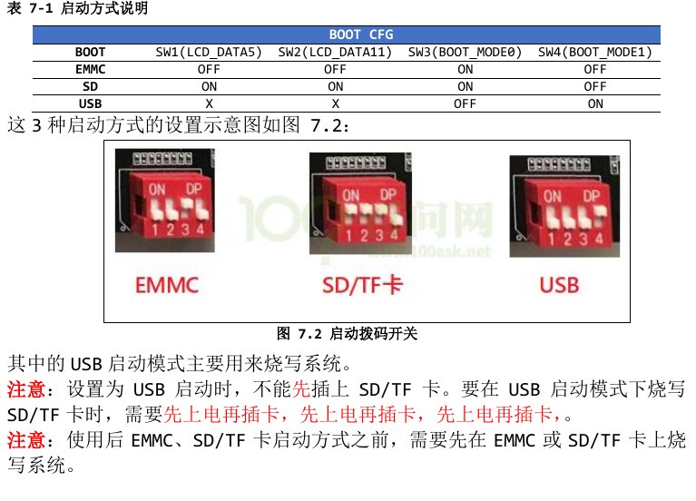
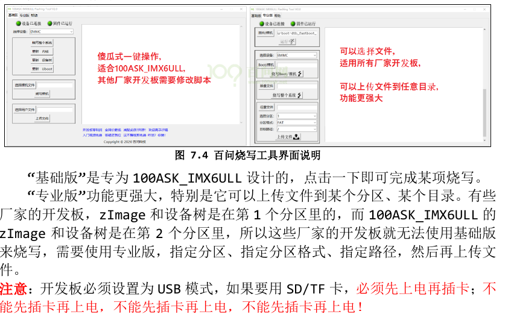
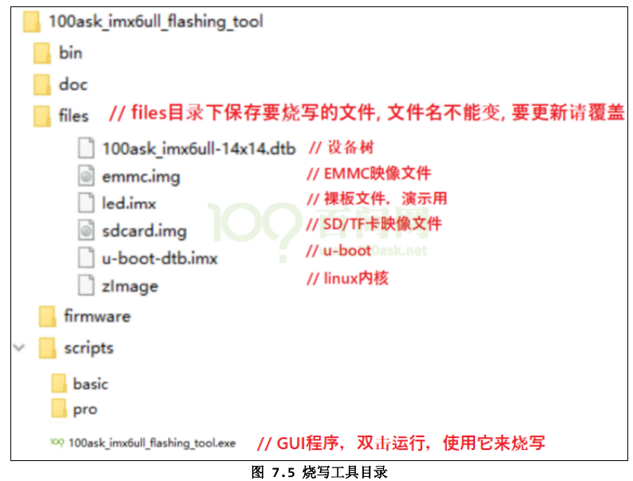
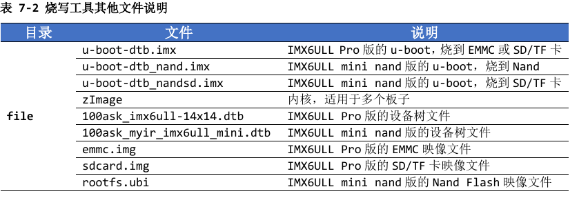
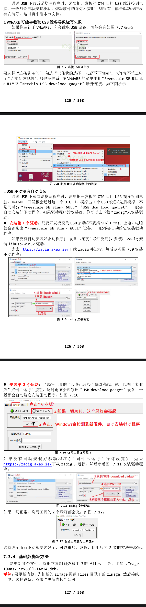
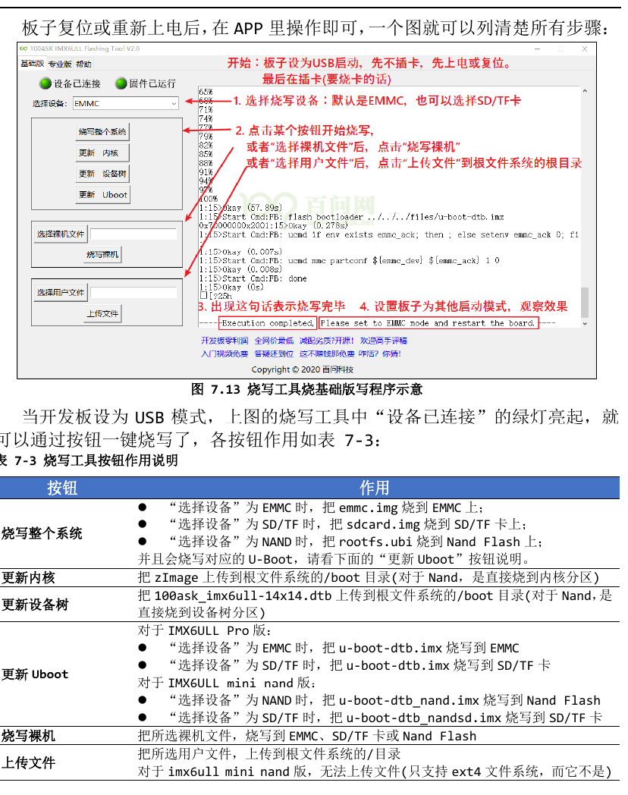
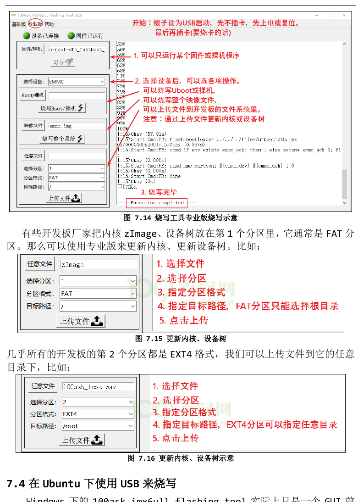

# 烧写整个系统或更新部分系统
## 100ASK_IMX6ULL启动开关
- 100ask_imx6ull Pro 版、mini emmc 版，都支持 USB、EMMC、SD/TF 卡三
种启动方式。板子背后都画有一个表格，表示这 3 种方式如何设置。表格如下：

## 在Windows使用USB烧写工具
- 在“**网盘的配套的资料/02_开发工具/100ask_imx6ull 烧写工具**”目录下双击运行 “100ask_imx6ull_flashing_tool.exe”。它有“基础版” 、 “专业版”两个页 面，如图所示

- “基础版”是专为 100ASK_IMX6ULL 设计的，点击一下即可完成某项烧写。
- “专业版”功能更强大，特别是它可以上传文件到某个分区、某个目录。有些 厂家的开发板，zImage 和设备树是在第 1 个分区里的，而 100ASK_IMX6ULL 的 zImage 和设备树是在第 2 个分区里，所以这些厂家的开发板就无法使用基础版 来烧写，需要使用专业版，指定分区、指定分区格式、指定路径，然后再上传文 件。
- 注意：开发板必须设置为 USB 模式，如果要用 SD/TF 卡，必须先上电再插卡；不 能先插卡再上电，不能先插卡再上电，不能先插卡再上电！
## 烧写工具目录详解

- 要留意的是 files 目录下的文件，各文件的作用在上图中列出来了，文件名 不能改变，要更新某文件时需要覆盖旧文件。
- 这个烧写工具不断更新，上述截图中 files 目录下内容可能会增加，更多文件内容请看下图

## 具体步骤
- 1、连接USB OTG线

- 2、安装IMX6ULL的USB驱动程序

- 3、基础版烧写方法
- 要更新某个文件，就把它复制到烧写工具的 files 目录，比如 zImage、 100ask_imx6ull-14x14.dtb。
- 举例：要更新内核，先把新的 zImage 覆盖 files 目录下的 zImage，然后接线， 上电，选择设备，点击“更新内核”即可。

- 4、专业版烧写方法
- 专业版的强大在于烧写文件时可以选择任意文件，上传文件时可以指定分区、 分区格式、目标路径。用法也很简单，一图足以说明：
