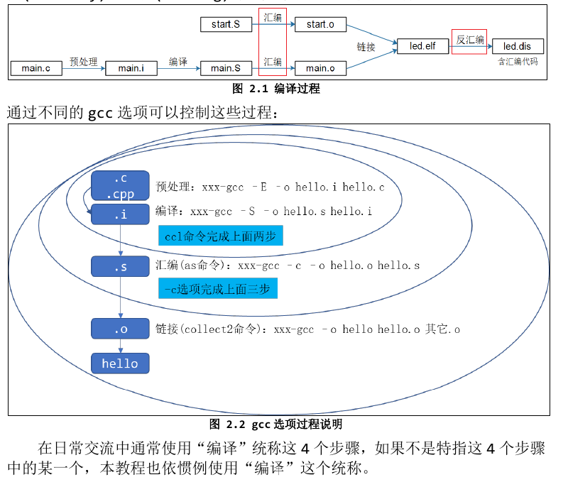

# GCC编译器的使用
- 一个 C/C++文件要经过预处理(preprocessing)、编译(compilation)、汇 编(assembly)和链接(linking)等 4 步才能变成可执行文件。

- gcc使用示例：
```shell
gcc hello.c // 输出一个名为 a.out 的可执行程序，然后可以执行./a.out
gcc -o hello hello.c // 输出名为 hello 的可执行程序，然后可以执行./hello
gcc -o hello hello.c -static // 静态链接
gcc -c -o hello.o hello.c // 先编译(不链接)
gcc -o hello hello.o // 再链接
```
- 执行“gcc -o hello hello.c -v”时，可以查看到这些步骤：
```shell
cc1 main.c -o /tmp/ccXCx1YG.s
as -o /tmp/ccZfdaDo.o /tmp/ccXCx1YG.s
cc1 sub.c -o /tmp/ccXCx1YG.s
as -o /tmp/ccn8Cjq6.o /tmp/ccXCx1YG.s
collect2 -o test /tmp/ccZfdaDo.o /tmp/ccn8Cjq6.o ....
```
- 可以手工执行以下命令体验一下：
```shell
gcc -E -o hello.i hello.c
gcc -S -o hello.s hello.i
gcc -c -o hello.o hello.s
gcc -o hello hello.o
```
## 常用编译选项

## 编译多个文件
- 1、一起编译、链接：
```shell
gcc -o test main.c sub.c
```
- 2、分开编译、统一链接
```shell
gcc -c -o main.o main.c
gcc -c -o sub.o sub.c
gcc -o test main.o sub.o
```
## 制作、使用静态库
```shell
gcc -c -o main.o main.c
gcc -c -o sub.o sub.c
ar crs libsub.a sub.o sub2.o sub3.o(可以使用多个.o 生成静态库) 
gcc -o test main.o libsub.a (如果.a 不在当前目录下，需要指定它的绝对或相对路径)
```
- 运行：不需要把静态库 libsub.a 放到板子上。
- 注意：执行 **arm-buildroot-linux-gnueabihf-gcc -c -o sub.o sub.c** 交叉编译需要在 最后面加上-fPIC参数。
## 制作、使用动态库
- 1、制作、编译：
```shell
gcc -c -o main.o main.c
gcc -c -o sub.o sub.c
gcc -shared -o libsub.so sub.o sub2.o sub3.o(可以使用多个.o 生成动态库)
gcc -o test main.o -lsub -L /libsub.so/所在目录/
```
- 2、运行：
    - 1、先把 libsub.so 放到 Ubuntu 的/lib 目录，然后就可以运行 test 程序。
    - 2、如果不想把 libsub.so 放到/lib，也可以放在某个目录比如/a，然后如下执行：
    ```shell
    export LD_LIBRARY_PATH=$LD_LIBRARY_PATH:/a ./test
    ```
## 很有用的选项
```shell
gcc -E main.c // 查看预处理结果，比如头文件是哪个
gcc -E -dM main.c > 1.txt // 把所有的宏展开，存在 1.txt 里
gcc -Wp,-MD,abc.dep -c -o main.o main.c // 生成依赖文件 abc.dep，后面 Makefile 会用
echo 'main(){}'| gcc -E -v - // 它会列出头文件目录、库目录(LIBRARY_PATH)
```