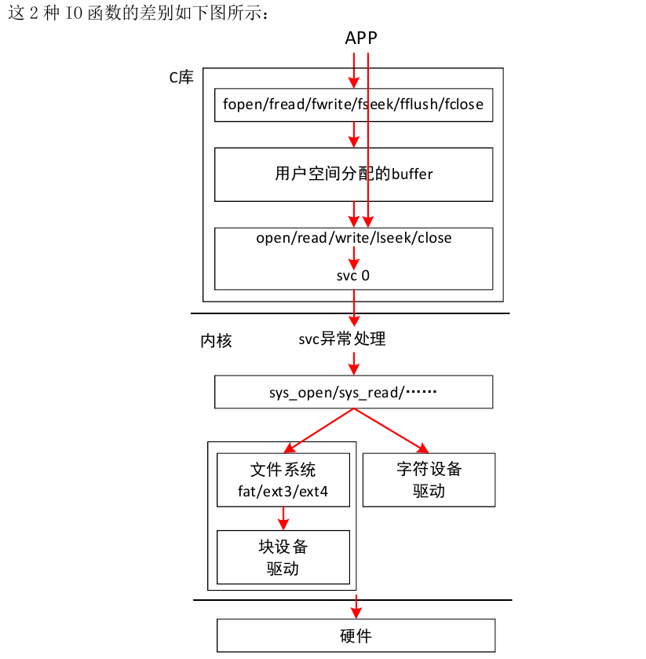
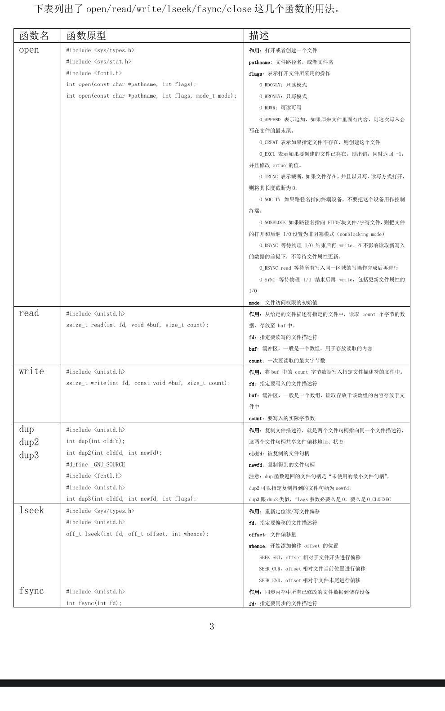
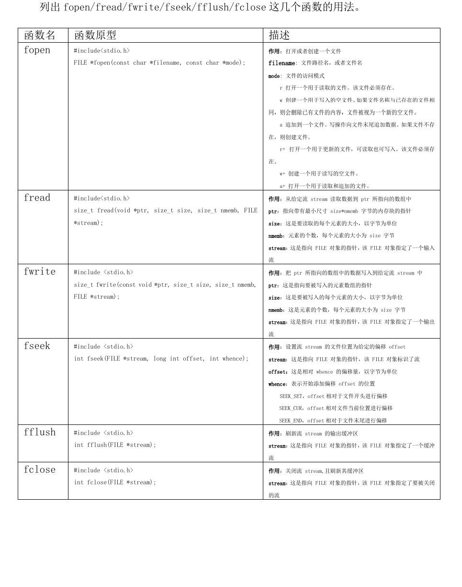

# 一、文件基础操作
## 1.1 文件IO函数分类
- 在Linux上操作文件时，有两套函数：**标准IO、系统调用IO**，标准IO的相关函数是：**fopen/fread/fwrite/fseek/fflush/fclose等**，系统调用IO的相关函数是：**open/read/write/lseek/fsync/close**

- 标准 IO 的内部，会分配一个用户空间的 buffer，读写操作先经过这个 buffer。在有必
要时，才会调用底下的系统调用 IO 向内核发起操作。
- 所以：**标准 IO 效率更高(引入了用户buffer，减少切换至内核状态)**；但是要**访问驱动程序时就不能使用标准IO，而是使用系统调用IO**。

## 1.2 函数原型
### 1.2.1 系统调用接口

### 1.2.2 标准IO接口
