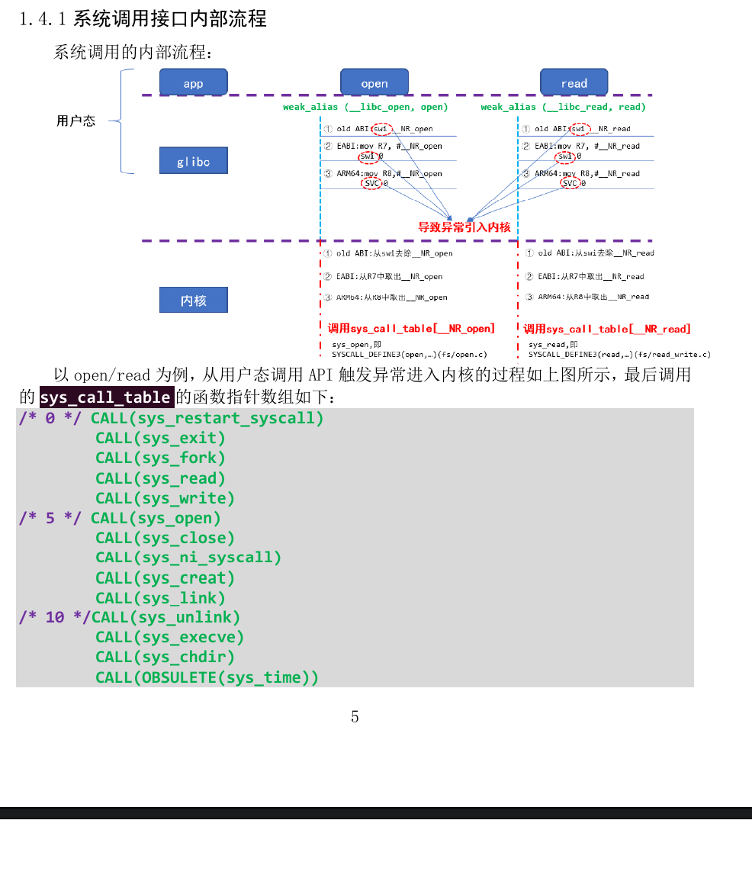
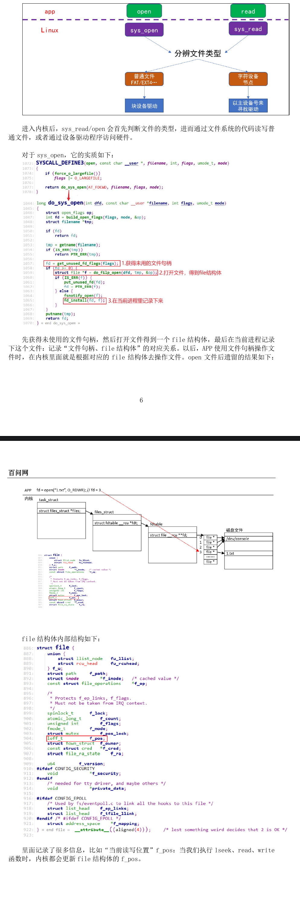
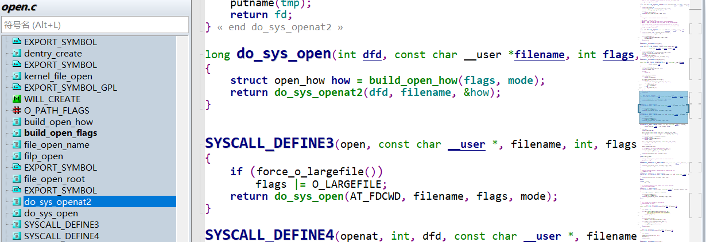
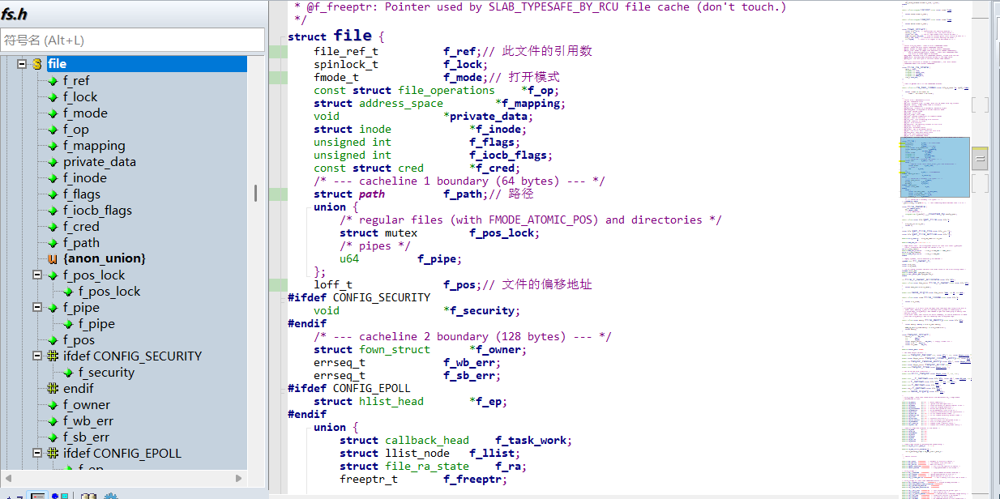
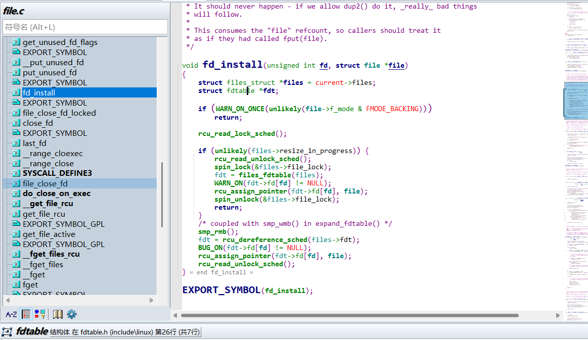
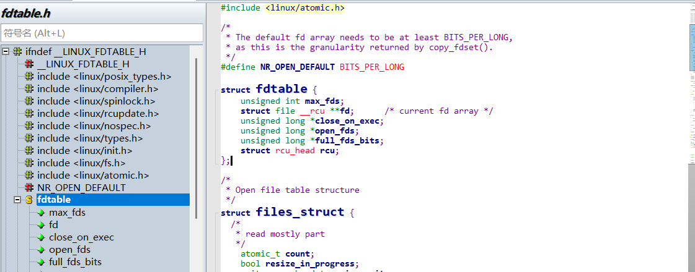

# 内部机制
## 原理
|分布|调用|
|----------|------------|
|**用户空间**|**APP**:open/read/write **glibc(GNU LIBRARY C)**:系统调用接口，触发异常：设置触发原因，SWI/SVC|
|**内核空间**|Linux内核：分辨异常原因并处理异常|

## 系统调用接口内部流程

### 内核的sys_open、sys_read会做什么？

### 分析
- 应用程序的open函数最终会调用到这里的**SYSCALL_DEFINE3**中的3代表3个参数
  
- file结构体详解(在include/linux/fs.h中被定义)

- fd_install函数详解(在fs/file.c中被定义)
- fd_install中的current变量结构体声明中含有fdt

- fdtable中含有**struct file __rcu \*\*fd**结构体

- ABI:application binary interface
- OABI:old application binary interface
- EABI:embedded application binary interface