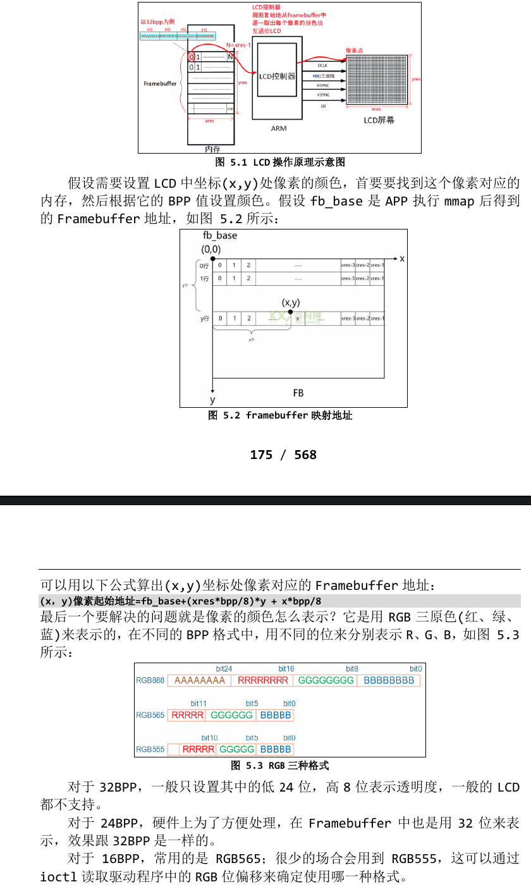

# Framebuffer应用编程
## LCD操作原理
- 在 Linux 系统中通过 Framebuffer 驱动程序来控制 LCD。**Frame**是**帧**的意思，**buffer**是**缓冲**的意思，这意味着 Framebuffer 就是一块内存，里面保存着 一帧图像。Framebuffer 中保存着一帧图像的每一个像素颜色值，假设 LCD 的 分辨率是 1024x768，每一个像素的颜色用 32 位来表示，那么 Framebuffer 的
大小就是：**1024x768x32/8=3145728 字节**。
- 简单介绍 LCD 的操作原理：
    - 1.驱动程序设置好LCD控制器：
        - 根据LCD的参数设置LCD控制器的时序、信号极性；
        - 根据LCD的分辨率、**BPP**(Bits Per Pixel)分配Framebuffer。
    - 2.APP使用ioctl获得LCD分辨率、BPP
    - 3.APP通过mmap映射Framebuffer，在Framebuffer中写入数据
    