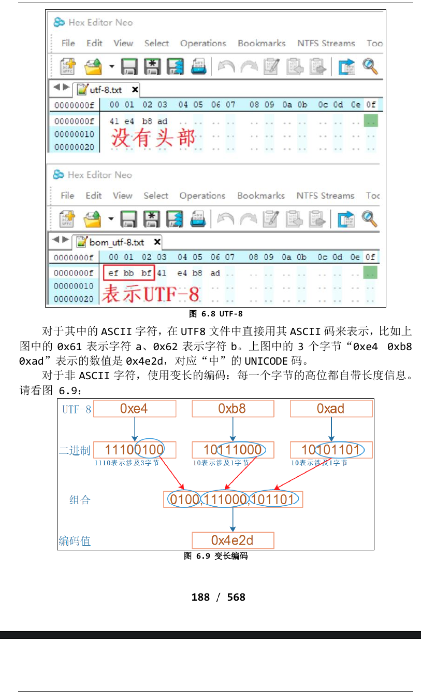
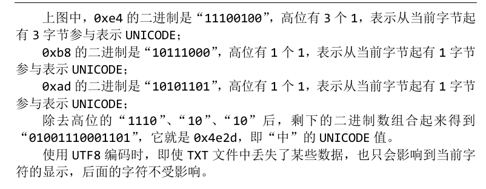

# 字符的编码方式
## 编码与字体
### 1.ASCII(美国信息交换标准代码,128个)
### 2.ANSI
- 强烈建议阅读：https://www.cnblogs.com/malecrab/p/5300486.html
- ASNI是ASCII的扩展，向下包含ASCII。**对于ASCII字符仍以一个字节来表示，对于非ASCII字符则使用2字节来表示**。并没有固定的ASNI编码，**它跟 “本地化”(locale)密切相关**。比如在中国大陆地区，ANSI的默认编码是GB2312；在港澳台地区默认编码是 BIG5。以数值“0xd0d6”为例，对于GB2312编码它表示“中”；对于BIG5编码它表示“笢”。所以对于ANSI编码的TXT文件，如果你打开它发现乱码，那么还得再次细分它的具体编码。
### 3.UNICODE
- 在 ANSI 标准中，很多种文字都有自己的编码标准，**汉字简体字有 GB2312、 繁体字有 BIG5，这难免同一个数值对应不同字符。比如数值“0xd0d6”，对于 GB2312 编码它表示“中” ；对于 BIG5 编码它表示“笢” 。这造成了使用 ANSI 编 码保存的文件，不适合跨地区交流**。
- UNICODE 编码就是解决这类问题：对于地球上任意一个字符，都给它一个唯一的数值。
- UNICODE 仍然向下兼容 ASCII，但是对于其他字符会有对应的数值，比如对于“中”、“笢”，它们的数值分别是：0x4e2d、0x7b22 
- **UNICODE 中的数值范围是 0x0000 至 0x10FFFF**，有 1,114,111 即100多万个数值，可以表示100多万个字符，足够地球人使用了。
#### UNICODE编码实现
- 1. **ASCII编码**中**使用一个字节来表示一个字符，只用到其中的7位**，**最高位恒为 0**；
- 2. **ANSI编码**中，**对于ASCII字符仍使用一个字节来表示(BIT7 是 0)，对于非 ASCII 字符一般使用 2 个字节来表示，非 ASCII 字符的数值 BIT7 都是 1**。
- 3. **UNICODE**:
    - 1. 使用3个字节表示一个UNICODE（wrong）
    - 2. UCS-2 Little endian/UTF-16 LE
        - 每个 UNICODE 值用 3 字节来表示有点浪费，那只用 2 字节呢？它可以表示 2^16=65536 个字符，全世界常用的字符都可以表示了。
        - Little endian 表示小字节序，数值中权重低的字节放在前面，比如字符 “A 中”在 TXT 文件中的数值如下，其中的“A”使用“0x41 0x00”两字节表 示； “中”使用“0x2d 0x4e”两字节表示。文件开头的“0xff 0xfe”表示“UTF- 16 LE”。
    - 3. UCS-2 Big endian/UTF-16 BE
    - 4. UTF8
        - 使用 UTF8 可以解决上述所有问题。UTF8 是变长的编码方法，有 2 种 UTF8 格式的文件：**带有头部、不带头部**。
        
        

