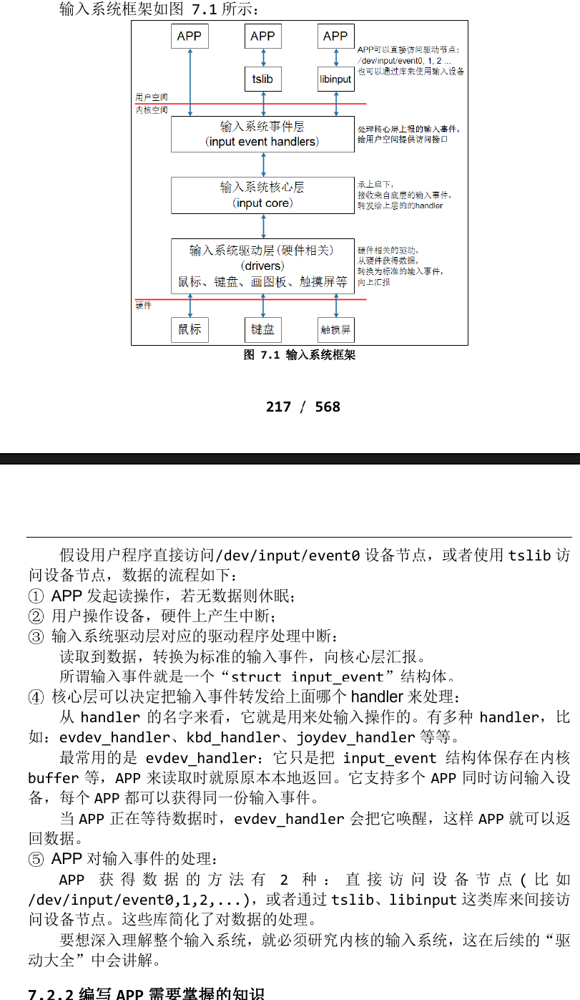

# 什么是输入系统
## 先来了解什么是输入设备？
- 常见的输入设备有键盘、鼠标、遥控杆、书写板、触摸屏等等,用户通过这些输入设备与 Linux 系统进行数据交换。
## 什么是输入系统？
- 输入设备种类繁多，能否统一它们的接口？既在驱动层面统一，也在应用程序层面统一？可以的。
- Linux 系统为了统一管理这些输入设备，实现了一套能兼容所有输入设备的框架：输入系统。驱动开发人员基于这套框架开发出程序，应用开发人员就可以使用统一的 API 去使用设备。
# 输入系统框架及调试
## 框架概述
- 作为应用开发人员，可以只基于 API 使用输入子系统。但是了解内核中输入子系统的框架、了解数据流程，有助于解决开发过程中碰到的硬件问题、驱动问题。

## 驱动程序上报的数据含有三项重要内容：
- 1. type:哪类?比如EV_KEY,按键类
- 2. code:哪个?比如KEY_A
- 3. value:值,比如0-松开，1-按下，2-长按

## 编写APP需要掌握的知识
- 1.内核中如何表示一个输入设备?
    - 使用input_dev结构体来表示输入设备(include/linux/input.h中)
    ```c
    struct input_dev {
	const char *name;
	const char *phys;
	const char *uniq;
	struct input_id id;

	unsigned long propbit[BITS_TO_LONGS(INPUT_PROP_CNT)];

	unsigned long evbit[BITS_TO_LONGS(EV_CNT)];// 支持哪类事件？key/rel/abs?
	unsigned long keybit[BITS_TO_LONGS(KEY_CNT)];// 支持按键的话，支持哪些按键
	unsigned long relbit[BITS_TO_LONGS(REL_CNT)];// 支持相对位移的话，支持哪些
	unsigned long absbit[BITS_TO_LONGS(ABS_CNT)];// 支持绝对位移的话，支持哪些
	unsigned long mscbit[BITS_TO_LONGS(MSC_CNT)];
	unsigned long ledbit[BITS_TO_LONGS(LED_CNT)];
	unsigned long sndbit[BITS_TO_LONGS(SND_CNT)];
	unsigned long ffbit[BITS_TO_LONGS(FF_CNT)];
    ```
- 2.APP可以得到什么数据?
    - 可以得到一系列的输入事件，就是一个一个“struct input_event”(include\uapi\linux\input.h)
    ```c
    /*
    * The event structure itself
    * Note that __USE_TIME_BITS64 is defined by libc based on
    * application's request to use 64 bit time_t.
    */

    struct input_event {
    #if (__BITS_PER_LONG != 32 || !defined(__USE_TIME_BITS64)) && !defined(__KERNEL__)
        struct timeval time;
    #define input_event_sec time.tv_sec
    #define input_event_usec time.tv_usec
    #else
        __kernel_ulong_t __sec;
    #if defined(__sparc__) && defined(__arch64__)
        unsigned int __usec;
        unsigned int __pad;
    #else
        __kernel_ulong_t __usec;
    #endif
    #define input_event_sec  __sec
    #define input_event_usec __usec
    #endif
        __u16 type;
        __u16 code;
        __s32 value;
    };
    ```
    - timeval在**include\uapi\linux\time.h**中定义：
    ```c
    struct timeval {
        __kernel_old_time_t	tv_sec;		/* seconds */
        __kernel_suseconds_t	tv_usec;	/* microseconds */
    };
    ```
- 每个输入事件 input_event 中都含有发生时间：timeval 表示的是“自系统启动以来过了多少时间”，它是一个结构体，含有“tv_sec、tv_usec”两项(即秒、微秒)。
- 输入事件 input_event 中更重要的是： type(哪类事件)、 code(哪个事件)、value(事件值)，细讲如下：
    - 1. type:表示哪类事件
        - 比如 EV_KEY 表示按键类、EV_REL 表示相对位移(比如鼠标)，EV_ABS 表示绝对位置(比如触摸屏):(**include\uapi\linux\input-event-codes.h**)
        ```c
        /*
        * Event types
        */

        #define EV_SYN			0x00
        #define EV_KEY			0x01
        #define EV_REL			0x02
        #define EV_ABS			0x03
        #define EV_MSC			0x04
        #define EV_SW			0x05
        #define EV_LED			0x11
        #define EV_SND			0x12
        #define EV_REP			0x14
        #define EV_FF			0x15
        #define EV_PWR			0x16
        #define EV_FF_STATUS		0x17
        #define EV_MAX			0x1f
        #define EV_CNT			(EV_MAX+1)
        ```
        ```shell
        [root@100ask:~/app_demos/freetypeDemo]# cat /proc/bus/input/devices
        I: Bus=0019 Vendor=0000 Product=0000 Version=0000
        N: Name="20cc000.snvs:snvs-powerkey"
        P: Phys=snvs-pwrkey/input0
        S: Sysfs=/devices/soc0/soc/2000000.aips-bus/20cc000.snvs/20cc000.snvs:snvs-powerkey/input/input0
        U: Uniq=
        H: Handlers=kbd event0 evbug
        B: PROP=0
        B: EV=3
        B: KEY=100000 0 0 0
        I: Bus=0018 Vendor=dead Product=beef Version=28bb
        N: Name="goodix-ts"
        P: Phys=input/ts
        S: Sysfs=/devices/virtual/input/input1
        U: Uniq=
        H: Handlers=event1 evbug
        B: PROP=2
        B: EV=b   # 1011代表支持0,1,3号事件
        B: KEY=1c00 0 0 0 0 0 0 0 0 0 0
        B: ABS=6e18000 0
        I: Bus=0019 Vendor=0001 Product=0001 Version=0100
        N: Name="gpio-keys"
        P: Phys=gpio-keys/input0
        S: Sysfs=/devices/soc0/gpio-keys/input/input2
        U: Uniq=
        H: Handlers=kbd event2 evbug
        B: PROP=0
        B: EV=3
        B: KEY=c
        ```
        ```shell
        [root@100ask:~/app_demos/freetypeDemo]# hexdump /dev/input/event1
        0000000 435d 0003 421c 000e 0003 0039 0040 0000
        0000010 435d 0003 421c 000e 0003 0035 0121 0000
        0000020 435d 0003 421c 000e 0003 0036 00f9 0000
        0000030 435d 0003 421c 000e 0003 0030 002e 0000
        0000040 435d 0003 421c 000e 0003 003a 002e 0000
        0000050 435d 0003 421c 000e 0001 014a 0001 0000
        0000060 435d 0003 421c 000e 0000 0000 0000 0000
        0000070 435e 0003 e446 0007 0003 0039 ffff ffff
        0000080 435e 0003 e446 0007 0001 014a 0000 0000
        0000090 435e 0003 e446 0007 0000 0000 0000 0000
        ```
    - 2. code:表示该类事件下的哪一个事件
        - 比如对于 EV_KEY(按键)类事件，它表示键盘。键盘上有很多按键，比如数字键 1、2、3，字母键 A、B、C 里等:
        ```c
        /*
        * Keys and buttons
        *
        * Most of the keys/buttons are modeled after USB HUT 1.12
        * (see http://www.usb.org/developers/hidpage).
        * Abbreviations in the comments:
        * AC - Application Control
        * AL - Application Launch Button
        * SC - System Control
        */

        #define KEY_RESERVED		0
        #define KEY_ESC			1
        #define KEY_1			2
        #define KEY_2			3
        #define KEY_3			4
        #define KEY_4			5
        #define KEY_5			6
        #define KEY_6			7
        #define KEY_7			8
        #define KEY_8			9
        #define KEY_9			10
        #define KEY_0			11
        #define KEY_MINUS		12
        #define KEY_EQUAL		13
        #define KEY_BACKSPACE		14
        #define KEY_TAB			15
        ```
        - 对于触摸屏，它提供的是绝对位置信息，有 X 方向、Y 方向，还有压力值：
        ```c
        /*
        * Absolute axes
        */

        #define ABS_X			0x00
        #define ABS_Y			0x01
        #define ABS_Z			0x02
        ```
    - 3. value:表示事件值
        - 对于按键，它的 value 可以是 0(表示按键被按下)、1(表示按键被松开)、 2(表示长按)；
        - 对于触摸屏，它的 value 就是坐标值、压力值。
    - 4. 事件之间的界限
        - APP 读取数据时，可以得到一个或多个数据，比如一个触摸屏的一个触点会 上报 X、Y 位置信息，也可能会上报压力值。
        - APP 怎么知道它已经读到了完整的数据？
            - 驱动程序上报完一系列的数据后，会上报一个“同步事件”，表示数据上报完毕。APP 读到“同步事件”时，就知道已经读完了当前的数据。同步事件也是一个 input_event 结构体，它的 type、code、value 三项都是 0。
