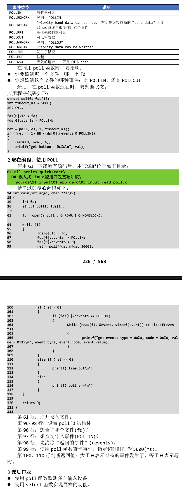

# 查询方式
- APP 调用 open 函数时，传入“O_NONBLOCK”表示“非阻塞”。
- APP 调用 read 函数读取数据时，如果驱动程序中有数据，那么APP的read函数会返回数据，否则也会立刻返回错误。
# 休眠-唤醒方式
- APP 调用 open 函数时，不要传入“O_NONBLOCK”。
- APP 调用 read 函数读取数据时，如果驱动程序中有数据，那么 APP 的 read 函数会返回数据；否则 APP 就会在内核态休眠，当有数据时驱动程序会把 APP 唤 醒，read 函数恢复执行并返回数据给 APP。
# POLL/SELECT方式
- POLL 机制、SELECT 机制是完全一样的，只是 APP 接口函数不一样。
- 简单地说，它们就是“定个闹钟”：在调用 poll、select 函数时可以传入 “超时时间”。在这段时间内，条件合适时(比如有数据可读、有空间可写)就会 立刻返回，否则等到“超时时间”结束时返回错误。
- 用法如下:
    1. APP 先调用 open 函数时。
    2. APP 不是直接调用 read 函数，而是先调用 poll 或 select 函数，这 2 个函 数中可以传入“超时时间”。它们的作用是：如果驱动程序中有数据，则立刻返回； 否则就休眠。在休眠期间，如果有人操作了硬件，驱动程序获得数据后就会把 APP 唤醒，导致 poll 或 select 立刻返回；如果在“超时时间”内无人操作硬件，则 时间到后 poll 或 select 函数也会返回。APP 可以根据函数的返回值判断返回 原因：有数据？无数据超时返回？
    3. APP 根据 poll 或 select 的返回值判断有数据之后，就调用 read 函数读取 数据时，这时就会立刻获得数据。
    4. poll/select 函数可以监测多个文件，可以监测多种事件：
    
# 异步通知方式
## 功能介绍
- 所谓同步，就是“你慢我等你” 。
- 那么异步就是：你慢那你就自己玩，我做自己的事去了，有情况再通知我。 所谓异步通知，就是 APP 可以忙自己的事，当驱动程序用数据时它会主动给 APP 发信号，这会导致 APP 执行信号处理函数。 
- 仔细想想“发信号” ，这只有 3 个字，却可以引发很多问题：
    1. 谁发：驱动程序发
    2. 发什么：信号
    3. 发什么信号: SIGIO
    4. 怎么发: 内核提供的函数
    5. 发给谁: APP，APP要把自己告诉驱动
    6. APP收到后做什么：执行信号处理函数
    7. 信号处理函数和信号，之间怎么挂钩：APP 注册信号处理函数   
- 在"**include\uapi\asm-generic\signal.h**"中，有很多信号的宏定义：
```c
#define SIGHUP		 1
#define SIGINT		 2
#define SIGQUIT		 3
#define SIGILL		 4
#define SIGTRAP		 5
#define SIGABRT		 6
#define SIGIOT		 6
#define SIGBUS		 7
#define SIGFPE		 8
#define SIGKILL		 9
#define SIGUSR1		10
#define SIGSEGV		11
#define SIGUSR2		12
#define SIGPIPE		13
#define SIGALRM		14
#define SIGTERM		15
#define SIGSTKFLT	16
#define SIGCHLD		17
#define SIGCONT		18
#define SIGSTOP		19
#define SIGTSTP		20
#define SIGTTIN		21
#define SIGTTOU		22
#define SIGURG		23
#define SIGXCPU		24
#define SIGXFSZ		25
#define SIGVTALRM	26
#define SIGPROF		27
#define SIGWINCH	28
#define SIGIO		29
#define SIGPOLL		SIGIO
```
- 驱动程序通知 APP 时，它会发出“SIGIO”这个信号，表示有“IO 事件”要处理。
- 就 APP 而言，你想处理 SIGIO 信息，那么需要提供信号处理函数，并且要跟 SIGIO 挂钩。这可以通过一个 signal 函数来“给某个信号注册处理函数” ，用法如下：
```shell
SIGNAL(2)                                                            Linux Programmer's Manual                                                           SIGNAL(2)
NAME
       signal - ANSI C signal handling

SYNOPSIS
       #include <signal.h>

       typedef void (*sighandler_t)(int);

       sighandler_t signal(int signum, sighandler_t handler);
```