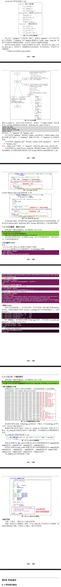

# tslib
- tslib 是一个触摸屏的开源库，可以使用它来访问触摸屏设备，可以给输入
设备添加各种“filter”(过滤器，就是各种处理)，地址是：http://www.tslib.org/。
- 编译 tslib 后，可以得到 libts 库，还可以得到各种工具：较准工具、测
试工具。

## tslib框架分析

## 交叉编译tslib
- 参考源码中的**configureScript.sh**脚本