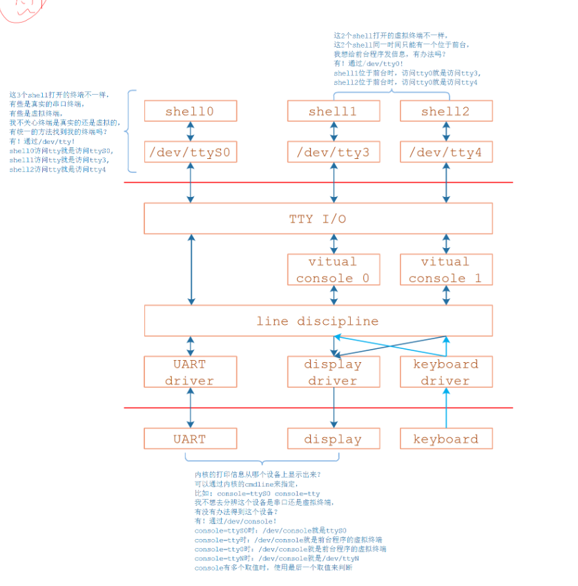

# TTY体系中设备节点的差别
## 1. 傻傻分不清楚
- /dev/ttyS0、/dev/ttySAC0、/dev/tty、/dev/tty0、/dev/tty1、/dev/console，它们有什么差别?

- TTY/Terminal/Console/UART，它们有什么差别？

## 2. 要讲历史了
- 1. 电传机teletype
    - teletype，更准确地说是teleprinter，是一种通信设备，可以用来发送、接收文本信息。
    - teletype是一家公司的名字，它生产的teleprinter实在太有名，结果公司名变成了这类产品的名字：teleprinter都被称为teletype了。
- 2. 各类设备节点的差别
    - 由于历史原因，下图中两条红线之内的代码被称为TTY子系统。
    - 它既支持UART，也支持键盘、显示器，还支持更复杂的功能(比如伪终端)。

- 3. Terminal和Console的差别
    - Terminal含有远端的意思，中文为：终端。Console翻译为控制台，可以理解为权限更大、能查看更多信息。比如我们可以在Console上看到内核的打印信息，从这个角度上看：
        - Console是某一个Terminal
        - Terminal并不都是Console
        - 我们可以从多个Terminal中选择一个作为Console
        - 很多时候，两个概念混用，并无明确的、官方的定义
- 4. /dev/console
    - 1. 选哪个？内核的打印信息从哪个设备上显示出来？
        - 可以通过内核的cmdline来指定，比如：console=ttyS0 console=tty
    - 2. 我不想去分辨这个设备是串口还是虚拟终端，有没有办法得到这个设备？
        - 有！通过/dev/console！
        - console=ttyS0时：/dev/console就是ttyS0
        - console=tty时：/dev/console就是前台程序的虚拟终端
        - console=tty0时：/dev/console就是前台程序的虚拟终端
        - console=ttyN时：/dev/console就是/dev/ttyN
        - console有多个取值时，使用最后一个取值来判断

