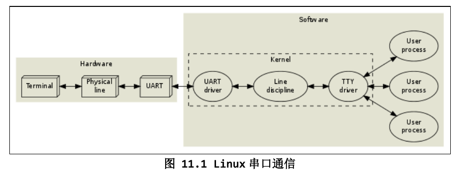
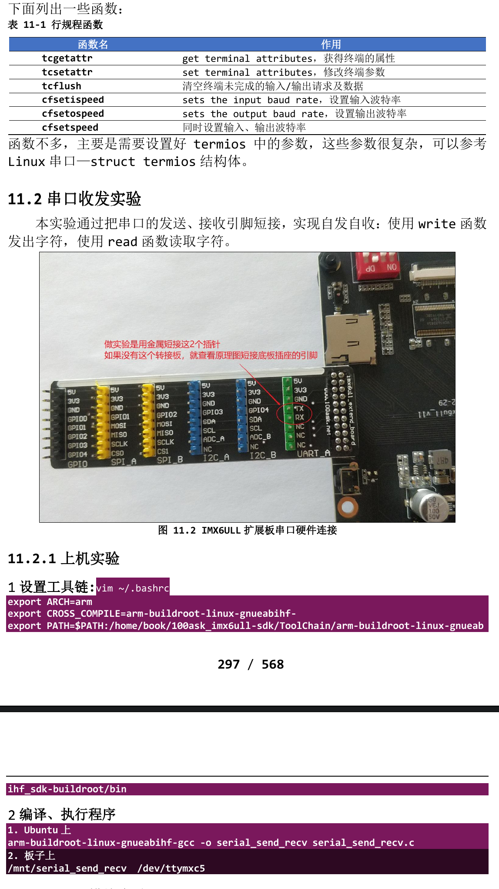

# 1. 串口API

- 在 Linux 系统中，操作设备的统一接口就是：open/ioctl/read/write。 对于 UART，又在 ioctl 之上封装了很多函数，主要是用来设置行规程。所以对 于 UART，编程的套路就是：
    - open:
    - 设置行规程，比如波特率、数据位、停止位、检验位、RAW 模式、一有数据就 返回；
    - read/write:
- 怎么设置行规程？行规程的参数用结构体 termios 来表示，可以参考Linux串口— struct termios 结构体：
> https://blog.csdn.net/yemingzhu163/article/details/5897156)
- 在"arch\alpha\include\uapi\asm\termbits.h"中
```c
#define NCCS 19
// termios:terminal IO set
struct termios {
	tcflag_t c_iflag;		/* input mode flags */
	tcflag_t c_oflag;		/* output mode flags */
	tcflag_t c_cflag;		/* control mode flags */
	tcflag_t c_lflag;		/* local mode flags */
	cc_t c_cc[NCCS];		/* control characters */
	cc_t c_line;			/* line discipline (== c_cc[19]) */
	speed_t c_ispeed;		/* input speed */
	speed_t c_ospeed;		/* output speed */
};
```
- 这些函数在名称上有一些惯例：
    - tc:terminal control
    - cf:control flag
    

> 参考资料：
- Serial Programming Guide for POSIX Operating Systems：
    https://digilander.libero.it/robang/rubrica/serial.htm
- Linux串口编程：
    https://www.cnblogs.com/feisky/archive/2010/05/21/1740893.html
- Linux串口-struct termios结构体：
    https://blog.csdn.net/yemingzhu163/article/details/5897156