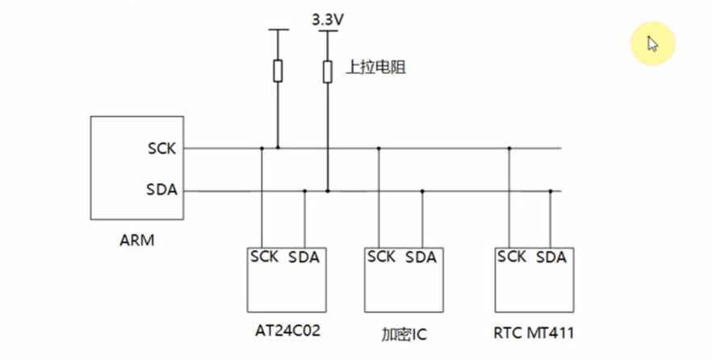
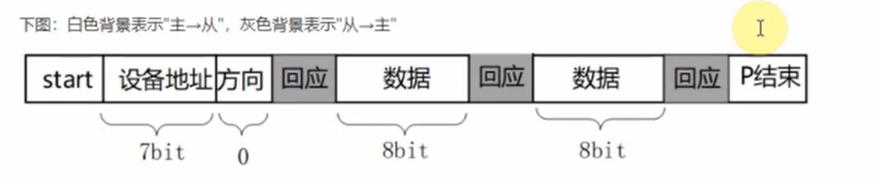
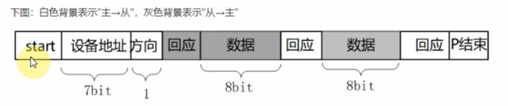
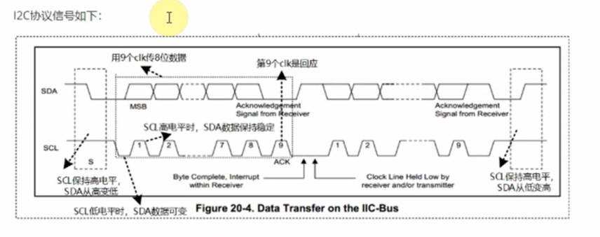
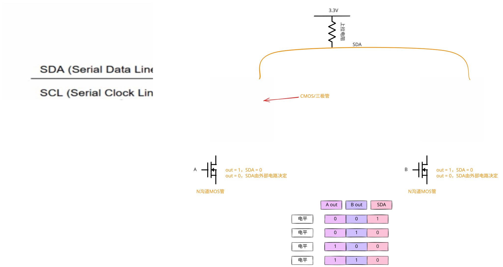

# I2C协议
## 1.硬件连接
- I2C在硬件上的接法如下所示，主控芯片引出两条线SCL,SDA线，在一条I2C总线上可以接很多I2C设备，我们还会放上一个上拉电阻：

## 2.IIC传输数据的格式
- 1. 写操作
    - 流程如下：
        - 1. 主芯片要发出一个start信号
        - 2. 然后发出一个设备地址(用来确定是往哪一个芯片写数据)，方向(读/写，0表示写，1表示读)
        - 3. 从设备回应(用来确定这个设备是否存在)，然后就可以传输数据
        - 4. 主设备发送一个字节数据给从设备，并等待回应
        - 5. 每传输一字节数据，接收方要有一个回应信号(确定数据是否接收完成)，然后再传输下一个数据
        - 6. 数据发送完之后，主芯片就会发送一个停止信号
        
- 2. 读操作
    - 流程如下：
        - 1. 主芯片要发出一个start信号
        - 2. 然后发出一个设备地址(用来确定是往哪一个芯片写数据)，方向(读/写，0表示写，1表示读)
        - 3. 从设备回应(用来确定这个设备是否存在)，然后就可以传输数据
        - 4. 从设备发送一个字节数据给主设备，并等待回应
        - 5. 每传输一字节数据，接收方要有一个回应信号(确定数据是否接收完成)，然后再传输下一个数据
        - 6. 数据发送完之后，主芯片就会发送一个停止信号
        
- 3. I2C信号
- I2C协议中数据传输的单位是字节，也就是8位。但是要用到9个时钟：前面8个时钟用来传输8数据，第9个时钟用来传输回应信号。传输时，先传输最高位(MSB)。
    - 开始信号(S):SCL为高电平，SDA由高电平向低电平跳变，开始传送数据。
    - 结束信号(P):SCL为高电平，SDA由低电平向高电平跳变，结束传送数据。
    - 响应信号(ACK):接收器在接收到8为数据后，在第九个时钟周期，拉低SDA
    - SDA上传输数据必须在SCL为高电平期间保持稳定，SDA上的数据只能在SCL为低电平期间变化
    
## 3.I2C协议硬件原理

# I2C系统重要的结构体
- **在"include\linux\i2c.h"中**:
```c
// 表示I2C控制器
struct i2c_adapter {
	struct module *owner;
	unsigned int class;		  /* classes to allow probing for */
	const struct i2c_algorithm *algo; /* the algorithm to access the bus */
	void *algo_data;

	/* data fields that are valid for all devices	*/
	const struct i2c_lock_operations *lock_ops;
	struct rt_mutex bus_lock;
	struct rt_mutex mux_lock;

	int timeout;			/* in jiffies */
	int retries;
	struct device dev;		/* the adapter device */
	unsigned long locked_flags;	/* owned by the I2C core */
#define I2C_ALF_IS_SUSPENDED		0
#define I2C_ALF_SUSPEND_REPORTED	1

	int nr;
	char name[48];
	struct completion dev_released;

	struct mutex userspace_clients_lock;
	struct list_head userspace_clients;

	struct i2c_bus_recovery_info *bus_recovery_info;
	const struct i2c_adapter_quirks *quirks;

	struct irq_domain *host_notify_domain;
	struct regulator *bus_regulator;

	struct dentry *debugfs;

	/* 7bit address space */
	DECLARE_BITMAP(addrs_in_instantiation, 1 << 7);
};
```
- 描述i2c客户端的结构体: 
    - **在"include\linux\i2c.h"中**:
    ```c
        struct i2c_client {
            unsigned short flags;		/* div., see below		*/
        #define I2C_CLIENT_PEC		0x04	/* Use Packet Error Checking */
        #define I2C_CLIENT_TEN		0x10	/* we have a ten bit chip address */
                            /* Must equal I2C_M_TEN below */
        #define I2C_CLIENT_SLAVE	0x20	/* we are the slave */
        #define I2C_CLIENT_HOST_NOTIFY	0x40	/* We want to use I2C host notify */
        #define I2C_CLIENT_WAKE		0x80	/* for board_info; true iff can wake */
        #define I2C_CLIENT_SCCB		0x9000	/* Use Omnivision SCCB protocol */
                            /* Must match I2C_M_STOP|IGNORE_NAK */

            unsigned short addr;		/* chip address - NOTE: 7bit	*/
                            /* addresses are stored in the	*/
                            /* _LOWER_ 7 bits		*/
            char name[I2C_NAME_SIZE];
            struct i2c_adapter *adapter;	/* the adapter we sit on	*/
            struct device dev;		/* the device structure		*/
            int init_irq;			/* irq set at initialization	*/
            int irq;			/* irq issued by device		*/
            struct list_head detected;
        #if IS_ENABLED(CONFIG_I2C_SLAVE)
            i2c_slave_cb_t slave_cb;	/* callback for slave mode	*/
        #endif
            void *devres_group_id;		/* ID of probe devres group	*/
        };
    ```