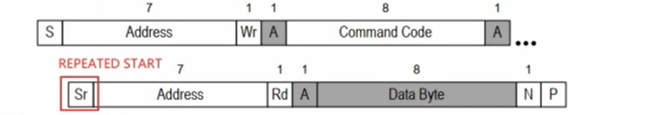

# SMBus协议
- 参考资料:
    - Linux内核文档:Documentation\i2c\smbus-protocal.rst
    - SMBus协议:
        -  http://www.smbus.org/specs/
        - SMBus_3_0_20141220.pdf
    - I2CTools:https://mirrors.edge.kernel.org/pub/software/utils/i2c-tools/
## 1.SMBus是I2C协议的一个子集
- **SMBus**:System Management Bus，系统管理总线
- SMBus最初的目的是为智能电池、充电电池、其他微控制器之间的通信链路而定义的。
- SMBus也被用来连接各种设备，包括电源相关设备，系统传感器，EEPROM通讯设备等等。
- SMBus为系统和电源管理这样的任务提供了一条控制总线，使用SMBus的系统，设备之间发送和接收消息都是通过SMBus，而不是使用单独的控制线，这样可以节省设备的管脚数。
- SMBus是基于I2C协议的，SMBus要求更严格，SMBus是I2C协议的子集。
- - - 
- SMBus有哪些更严格的要求？跟一般的I2C协议有哪些差别？
    - VDDd的极限值不一样
        - I2C协议: 范围广，甚至讨论了高达12V的情况
        - SMBus协议: 1.8V-5V
    - 最小时钟频率、最大的clock stretching
        - Clock Stretching含义: 某个设备需要更多的时间进行内部的处理时，它可以把SCL拉低占住和I2C总线
        - I2C协议: 时钟频率最小值无限制，Clock Stretching时长也没有限制
        - SMBus协议: 时钟频率最小值是10KHz，Clock Stretching的最大时间值也有限制
    - 地址回应(Address Acknowledge)
        - 一个I2C设备接收到它的设备地址后，是否必须发出回应信号？
        - I2C协议: 没有强制要求必须发出回应信号
        - SMBus: 强制要求必须发出回应信号，这样对方才知道该设备的状态：busy、failed，或是被移除了
    - SMBus协议明确了数据的传输格式
        - I2C协议: 它只定义了怎么传输数据，但并没有定义数据的格式，这完全由设备来定义
        - SMBus: 定义了几种数据格式(后面分析)
    - REPEATED START Condition(重复发出S信号)
        - 比如读EEPROM时，涉及两个操作：
            * 把存储地址发给设备
            * 读数据
        - 在写、读之间，可以不发出P信号，而是直接发出S信号：这个S信号就是REPEATED START
        - 如下图所示
            
    - SMBus Low Power Version
        - SMBus也有低功耗的版本
---
## 2. SMBus和I2C的建议
- 因为很多设备都实现了SMBus，而不是更宽泛得到的I2C协议，所以优先使用SMBus协议。
- 即使I2C控制器没有实现SMBus，软件方面也是可以使用I2C协议来模拟SMBus。**所以，Linux建议优先使用SMBus。**
