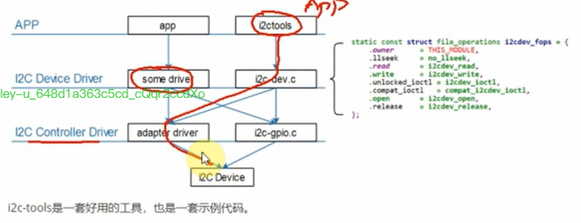
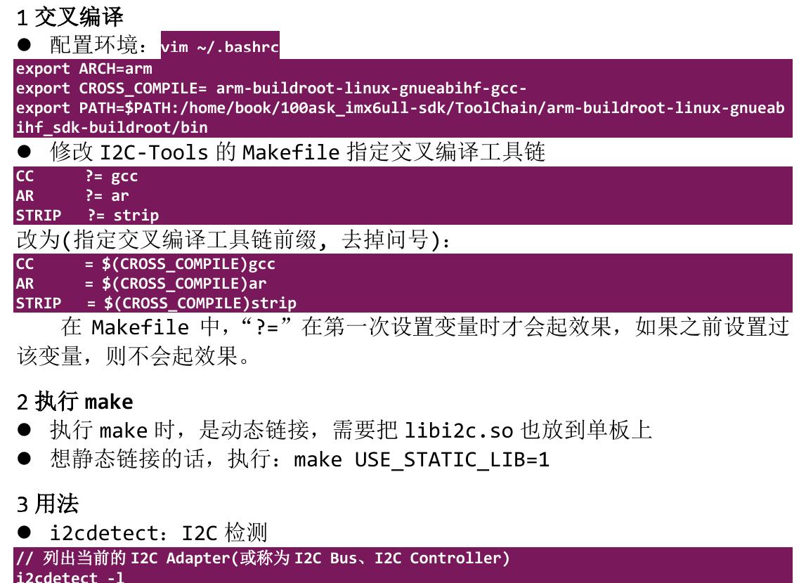
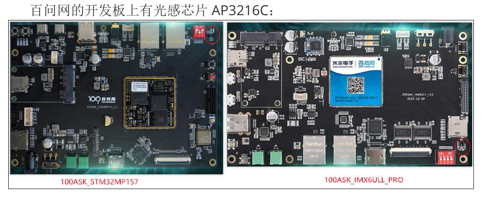
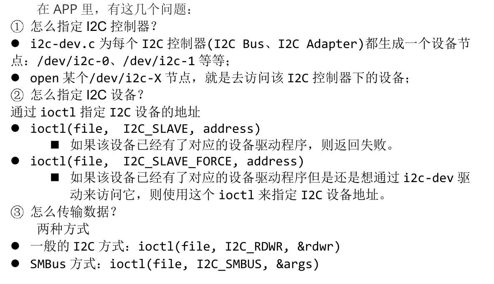
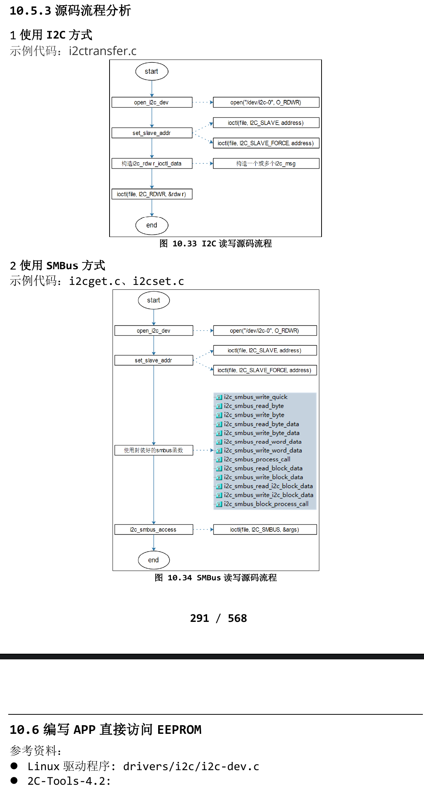

# 无需编写驱动程序即可访问i2c设备
- APP访问硬件肯定是需要驱动程序的。
- 对于I2C设备，内核提供了驱动程序drivers/i2c/i2c-dev.c，通过它可以直接使用下面的i2c控制器驱动程序来访问i2c设备。
    - 框架如下：
    
# 体验I2C-Tools
- 使用一句话概括I2C传输：APP通过I2C Controller与I2C Device传输数据
- 所以使用I2C-Tools时也需要指定：
    - 哪个I2C控制器(或称为I2C BUS、I2C Adapter)
    - 哪个I2C设备(设备地址)
    - 数据: 读还是写、数据本身
## 交叉编译

## 用法
- I2Cdetect: I2C检测
```shell
# 列出当前的I2C Adapter(或称为I2C Bus、I2C Controller)
i2cdetect -l

# 打印某个I2C Adapter的Functionlities，I2CBus为0、1、2等整数
i2cdetect -F <I2CBUS>

# 查看有哪些I2C设备，I2CBUS为0、1、2等整数
i2cdetect -y -a <I2CBUS>

```
## 使用I2C-Tools操作传感器AP3216C

- AP3216C是红外、光强、距离三合一的传感器，以读出光强、距离值为例，步骤如下：
    - 复位：往寄存器0写入0x04
    - 使能：往寄存器0写入0x03
    - 读光强：读寄存器0x0C、0x0D得到2字节的光强
    - 读距离：读寄存器0x0E、0x0F得到2字节的距离值
- AP3216C的设备地址是0x1E，假设接在I2C Adapter0上，操作命令如下：
    - 使用SMBus协议
        ```shell
        i2cset -f -y 0 0x1e 0 0x04
        i2cset -f -y 0 0x1e 0 0x03
        i2cget -f -y 0 0x1e 0x0c w
        i2cget -f -y 0 0x1e 0x0e w
        ```
    - 使用I2C协议
        ```shell
        i2ctransfer -f -y 0 w2@0x1e 0 0x4
        i2ctransfer -f -y 0 w2@0x1e 0 0x3
        i2ctransfer -f -y 0 w1@0x1e 0xc r2
        i2ctransfer -f -y 0 w1@0x1e 0xe r2
        ```
## I2C-Tools访问I2C设备的2种方式
- I2C-Tools 可以通过 SMBus 来访问 I2C 设备，也可以使用一般的 I2C 协议来访问 I2C 设备。
- 使用一句话概括 I2C 传输：APP 通过 I2C Controller 与 I2C Device 传输数据。

## 源码流程分析
