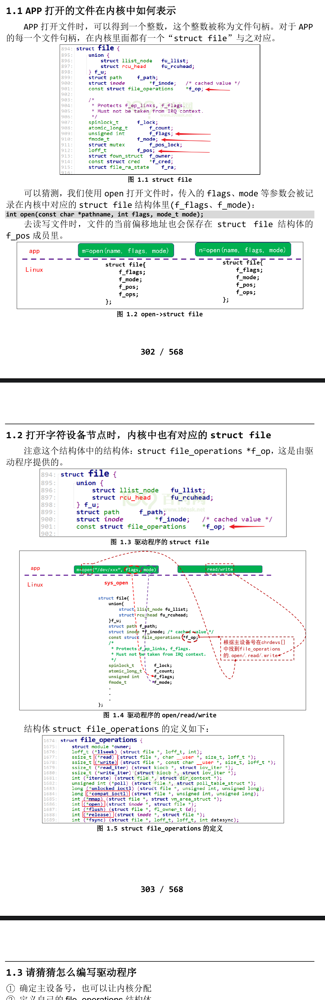

# Hello驱动(不涉及硬件操作)
- 我们选用的内核都是4.x版本，操作都是类似的：
    - rk3399 linux 4.4.154
    - rk3288 linux 4.4.154
    - imx6ul linux 4.9.88
    - am3358 linux 4.9.168
## APP打开的文件在内核中如何表示

## 1.3 请猜猜怎么编写驱动程序(重要)
- 1.确定主设备号，也可以让内核分配
- 2.定义自己的 **file_operations** 结构体
- 3.实现对应的 **drv_open/drv_read/drv_write** 等函数，填入 file_operations 结构体
- 4.把 file_operations 结构体告诉内核：**register_chrdev** 谁来注册驱动程序啊？得有一个入口函数：安装驱动程序时，就会去调用这个入口函数
- 5.有入口函数就应该有出口函数：卸载驱动程序时，出口函数调用**unregister_chrdev**
- 6.其他完善：提供设备信息，自动创建设备节点：**class_create,device_create**