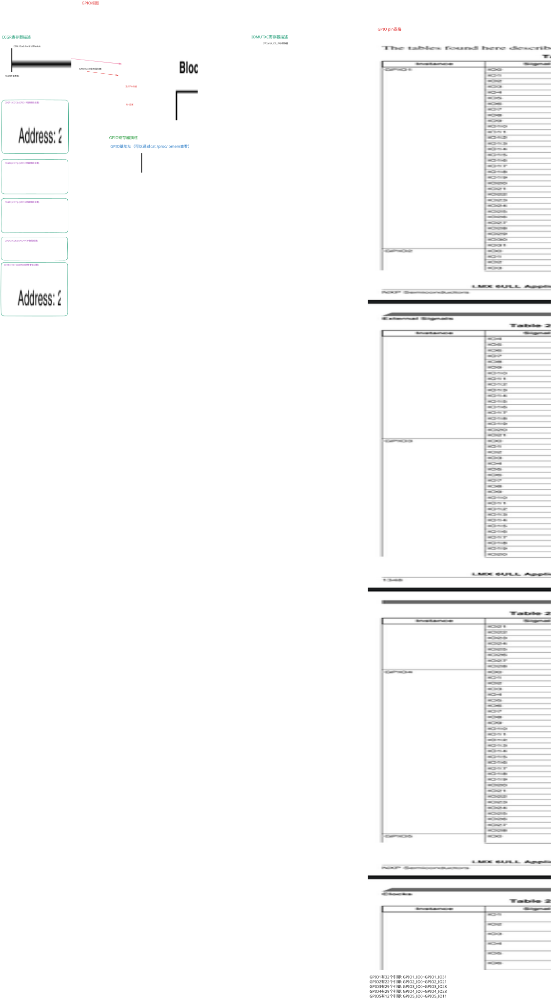

# 普适的GPIO引脚操作方法
- GPIO(General Purpose Input/Output)是通用输入输出引脚，是一种通用的数字输入输出引脚，可以通过编程的方式控制其输入输出状态。

## 1. GPIO模块一般结构：
- 1. 有多组GPIO，每组有多个GPIO
- 2. 使能: 电源/时钟
- 3. 模式(Mode): 引脚可用于GPIO或其他功能
- 4. 方向(Direction): 引脚Mode设置为GPIO后，需要设置为输入或输出
- 5. 数值: 对于输出引脚，可以设置寄存器让它输出高、低电平
        - 对于输入引脚，可以读取寄存器获取引脚的电平状态 

## 2. GPIO寄存器操作          
- 芯片手册一般有相关章节，用来介绍：power/clock
    - 可以设置对应寄存器使能某个 GPIO 模块(Module)
    - 有些芯片的 GPIO 是没有使能开关的，即它总是使能的
- 一个引脚可以用于 GPIO、串口、USB 或其他功能，
    - 有对应的寄存器来选择引脚的功能
- 对于已经设置为 GPIO 功能的引脚，有方向寄存器用来设置它的方向：输出、输入
- 对于已经设置为 GPIO 功能的引脚，有数据寄存器用来写、读引脚电平状态
---
- GPIO寄存器的 2 种操作方法：**原则：不能影响到其他位**:
    - 1. 直接读写：读出、修改对应位、写入
        - 1. 要设置bit n:
        ```c
        val = data_reg;
        val = val | (1<<n);
        data_reg = val;
        ```  
        - 2. 要清除bit n
        ```c
        val = data_reg;
        val = val & ~(1<<n);
        data_reg = val;
        ```                              
    - 2. set-and-clear protocal:
        - set_reg, clr_reg, data_reg 三个寄存器对应的是同一个物理寄存器,
            - 1. 要设置bit n: 
                ```c 
                set_reg = (1<<n);
                ```
            - 2. 要清除bit n:
                ```c
                clr_reg = (1<<n);
                ```
## IMX6ULL芯片手册GPIO启动解析：
