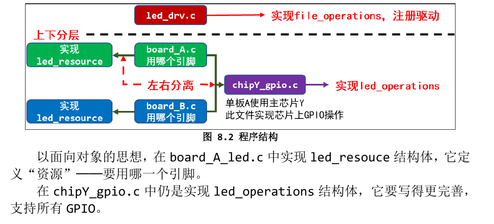

# 驱动设计的思想: 面向对象/分层/分离
## 面向对象
- 字符设备驱动程序抽象出一个file_operations结构体
- 我们写的程序针对硬件部分抽象出led_operations结构体
## 分层
- 上下分层，比如我们前面写的LED驱动程序就分为2层：
    - 1. 上层实现硬件无关的操作，比如注册字符设备驱动:led_drv.c
    - 2. 下层实现硬件相关的操作，比如board_A.c实现单板A的LED操作
## 分离
- 还能不能改进？分离！
- 在board_A.c中实现一个led_operations，为LED引脚实现了初始化函数、控制函数:
```c
static struct led_operations board_demo_led_opr = {
.num = 1,
.init = board_demo_led_init,
.ctl = board_demo_led_ctl,
};
```
- 如果硬件上更换一个引脚来控制 LED 怎么办？你要去修改上面结构体中的init、ctl 函数。
- 实际情况是，每一款芯片它的 GPIO 操作都是类似的。比如：GPIO1_3、GPIO5_4 这 2 个引脚接到 LED：
    - 1. GPIO1_3 属于第 1 组，即 GPIO1。
        - a. 有方向寄存器 DIR、数据寄存器 DR 等，基础地址是addr_base_addr_gpio1。
        - b. 设置为 output 引脚：修改 GPIO1 的 DIR 寄存器的 bit3。
        - c. 设置输出电平：修改 GPIO1 的 DR 寄存器的 bit3。
    - 2. GPIO5_4 属于第 5 组，即 GPIO5。
        - a. 有方向寄存器 DIR、数据寄存器 DR 等，基础地址是addr_base_addr_gpio5。
        - b. 设置为 output 引脚：修改 GPIO5 的 DIR 寄存器的 bit4。
        - c. 设置输出电平：修改 GPIO5 的 DR 寄存器的 bit4。
- 既然引脚操作那么有规律，并且这是跟主芯片相关的，那可以针对该芯片写出比较通用的硬件操作代码。
- 比如 board_A.c 使用芯片 chipY，那就可以写出：chipY_gpio.c，它实现芯片 Y 的 GPIO 操作，适用于芯片 Y 的所有 GPIO 引脚。
- 使用时，我们只需要在 board_A_led.c 中指定使用哪一个引脚即可。程序结构如下：
