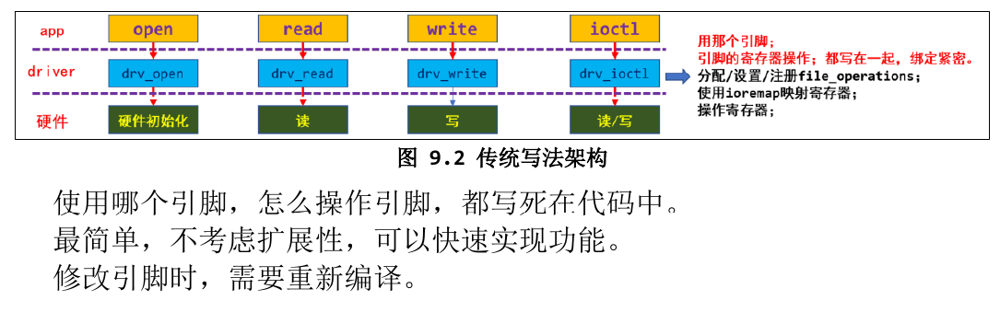
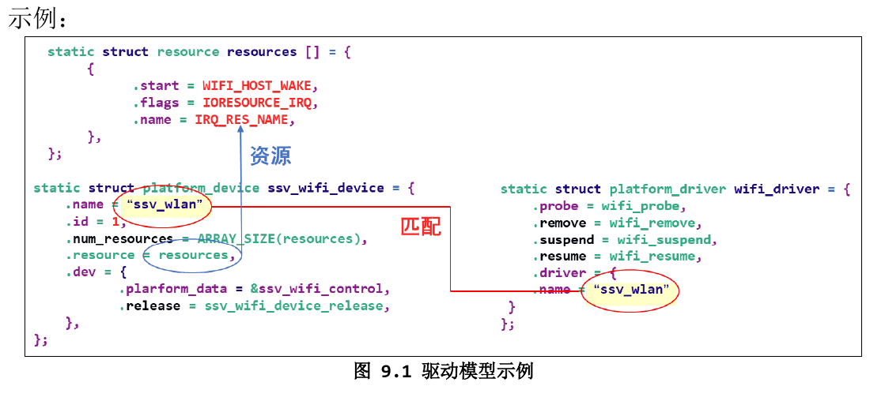
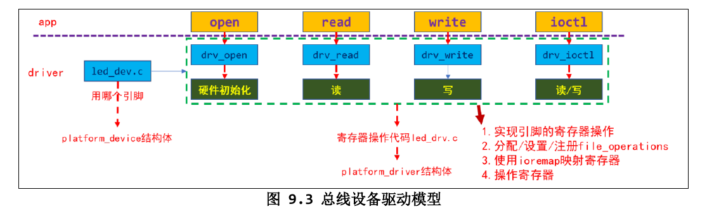
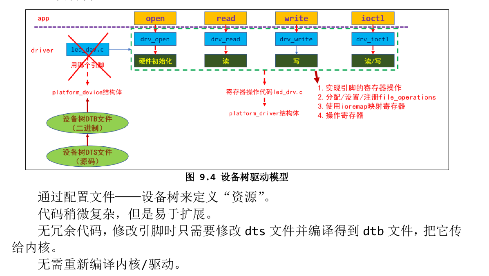
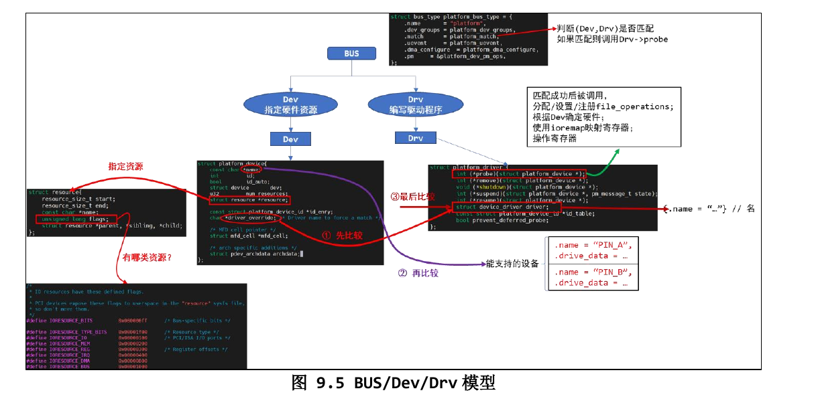
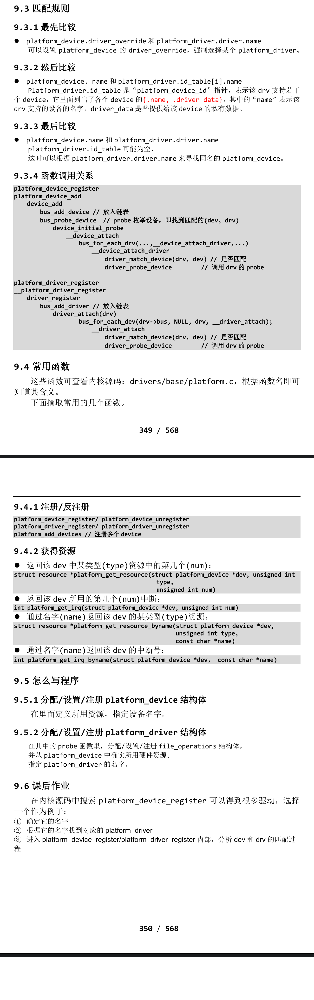

# 驱动进化之路:总线设备驱动模型

## 驱动编写的3种方法
- 1. 传统的驱动编写方法

- 2. 总线设备驱动模型

    - 引入 platform_device/platform_driver，将“资源”与“驱动”分离开来。
    - 代码稍微复杂，但是易于扩展。
    - 冗余代码太多，修改引脚时设备端的代码需要重新编译。
    - 更换引脚时，上图中的 led_drv.c 基本不用改，但是需要修改 led_dev.c。
- 3. 设备树

## 在Linux中实现“分离”：Bus/Dev/Drv模型

- 匹配规则

## 怎么写程序
- 1. 分配/设置/注册platform_device结构体
    - 在里面定义所用资源，指定设备名字。
- 2. 分配/设置/注册platform_driver结构体
    - 在其中的probe函数中，分配/设置/注册file_operations结构体，并从platform_device结构体中确认所用硬件资源。
    - 指定platform_driver的名字。