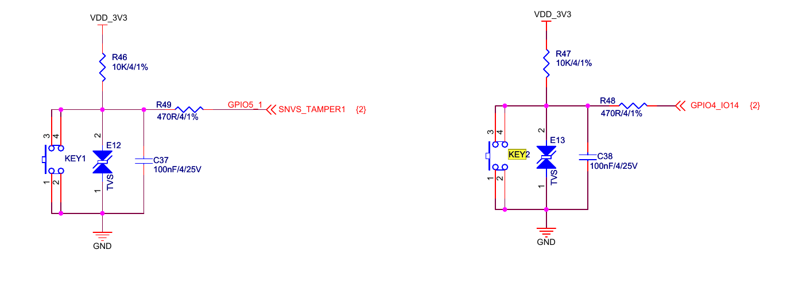

# APP怎么读取按键值
- APP读取按键值，需要有按键驱动程序。
- 为什么要讲按键驱动程序？
- APP去读按键的方法有4种:
    - 1. 查询方式
    - 2. 休眠-唤醒方式
    - 3. poll方式
    - 4. 异步通知方式
- 通过这4种方式的学习，我们可以掌握如下知识：
    - 1.驱动的基本技能: 中断、休眠、唤醒、poll等机制。
    - 2.APP开发的基本技能: 阻塞、非阻塞、休眠、poll、异步通知。
# 100ask imx6ullpro按键原理图

- 按键引脚为GPIO5_IO01、GPIO4_IO14
- 平时按键电平为高，按下按键后电平为低