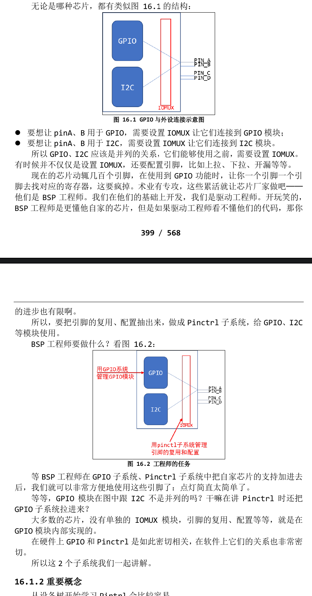
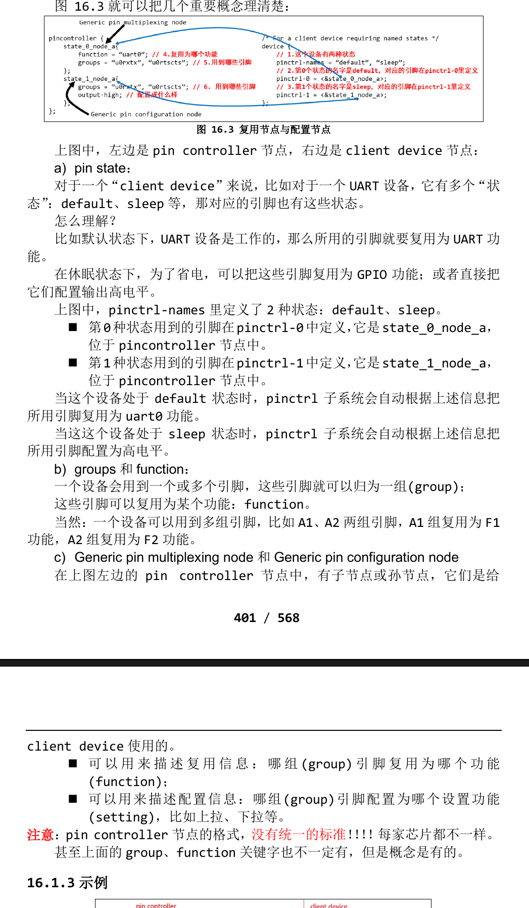

# GPIO和Pinctrl子系统的使用
> 参考文档
- a. 内核**Documentation/devicetree/bindings/Pinctrl**目录下:
>> Pinctrl-bindings.txt
- b. 内核**Documentation/gpio**目录下:
>> Pinctrl-bindings.txt
- c. 内核**Documentaion/devicetree/bindings/gpio**目录下:
>> gpio.txt 

- Linux下针对引脚有2个重要的子系统: GPIO、Pinctrl。
## Pinctrl子系统重要概念
- 引入
    无论是哪种芯片，都有类似下图的结构：
    
- 重要概念
    从设备树开始学习Pinctrl会比较容易
    主要参考文档是：内核**Documentation\devicetree\bindings\pinctrl\pinctrl-bindings.txt**
    - 这会涉及 2 个对象：pin controller、client device。
    - 前者提供服务：可以用它来复用引脚、配置引脚。
    - 后者使用服务：声明自己要使用哪些引脚的哪些功能，怎么配置它们。
- 1.pin controller:
    - 在芯片手册里你找不到 pin controller，它是一个软件上的概念，你可以认为它对应 IOMUX──用来复用引脚，还可以配置引脚(比如上下拉电阻等)。
    - 注意，pin controller 和 GPIO Controller 不是一回事，前者控制的引脚可用于 GPIO 功能、I2C 功能；后者只是把引脚配置为输入、输出等简单的功能。即先用 pin controller 把引脚配置为 GPIO，再用 GPIO Controler 把引脚配置为输入或输出。
- client device:
    - “客户设备”，谁的客户？Pinctrl 系统的客户，那就是使用 Pinctrl 系统的设备，使用引脚的设备。它在设备树里会被定义为一个节点，在节点里声明要用哪些引脚。
    
- 代码种如何引用pinctrl
    - 这是透明的，我们的驱动基本不用管。当设备切换状态时，对应的 pinctrl就会被调用。
    - 比如在 platform_device 和 platform_driver 的枚举过程中，流程如下：
    ```c
    /* If using pinctrl, bind pins now before probing */
	ret = pinctrl_bind_pins(dev);
				dev->pins->default_state = pinctrl_lookup_state(dev->pins->p,
								PINCTRL_STATE_DEFAULT);  /* 获得"default"状态的pinctrl */
				dev->pins->init_state = pinctrl_lookup_state(dev->pins->p,
								PINCTRL_STATE_INIT);    /* 获得"init"状态的pinctrl */

				ret = pinctrl_select_state(dev->pins->p, dev->pins->init_state);    /* 优先设置"init"状态的引脚 */
				ret = pinctrl_select_state(dev->pins->p, dev->pins->default_state); /* 如果没有init状态, 则设置"default"状态的引脚 */
	......
	ret = drv->probe(dev);
    ```
    - 当系统休眠时，也会去设置该设备 sleep 状态对应的引脚，不需要我们自己去调用代码。非要自己调用，也有函数：
    ```c
    devm_pinctrl_get_select_default(struct device *dev);// 使用"default"状态的引脚
    pinctrl_get_select(struct device *dev, const char *name); // 根据 name 选择某种状态的引
    脚
    pinctrl_put(struct pinctrl *p); // 不再使用, 退出时调用
    ```