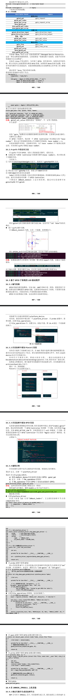

# GPIO子系统重要概念
## 引入
- 要操作 GPIO 引脚，先把所用引脚配置为 GPIO 功能，这通过 Pinctrl 子系统来实现。
- 然后就可以根据设置引脚方向(输入还是输出)、读值──获得电平状态，写值──输出高低电平。
- 以前我们通过寄存器来操作 GPIO 引脚，即使 LED 驱动程序，对于不同的板子它的代码也完全不同。
- 当 BSP 工程师实现了 GPIO 子系统后，我们就可以：
⚫ 在设备树里指定 GPIO 引脚
⚫ 在驱动代码中：使用 GPIO 子系统的标准函数获得 GPIO、设置 GPIO 方向、读取/设置 GPIO 值。
- 这样的驱动代码，将是单板无关的。

## 在设备树种指定引脚
- 在几乎所有 ARM 芯片中，GPIO 都分为几组，每组中有若干个引脚。所以在使用 GPIO 子系统之前，就要先确定：它是哪组的？组里的哪一个？
- 在设备树中，“GPIO 组”就是一个 GPIO Controller，这通常都由芯片厂家设置好。我们要做的是找到它名字，比如“gpio1”，然后指定要用它里面的哪个引脚，比如<&gpio1 0>。
- 有代码更直观，下图是一些芯片的 GPIO 控制器节点，它们一般都是厂家定义好，在 xxx.dtsi 文件中：
- 我们暂时只需要关心里面的这 2 个属性：
```dts
gpio-controller;
#gpio-cells = <2>;
```
⚫ “gpio-controller”表示这个节点是一个 GPIO Controller，它下面有很多引脚。
⚫ “#gpio-cells = <2>”表示这个控制器下每一个引脚要用 2 个 32 位的数(cell)来描述。
- 为什么要用 2 个数？其实使用多个 cell 来描述一个引脚，这是 GPIOController 自己决定的。比如可以用其中一个 cell 来表示那是哪一个引脚，用另一个 cell 来表示它是高电平有效还是低电平有效，甚至还可以用更多的cell 来示其他特性。
- 普遍的用法是，用第 1 个 cell 来表示哪一个引脚，用第 2 个 cell 来表示有效电平：
```dts
GPIO_ACTIVE_HIGH ： 高电平有效
GPIO_ACTIVE_LOW : 低电平有效
```
- 定义 GPIO Controller 是芯片厂家的事，我们怎么引用某个引脚呢？在自己的设备节点中使用属性"[\<name\>-]gpios"，示例如下：
```dts
led0: cpu{
    label = "cpu";
    gpios = <&gpio5 3 GPIO_ACTIVE_LOW>;
    default-state = "on";
    linux.default-trigger = "heartbeat";
};
gt9xx@5d {
    compatible = "goodix,gt9xx";
    reg = <0x5d>;
    status = "okay";
    interrupt-parent = <&gpio1>;
    interrupts = <5 IRQ_TYPE_EDGE_FALLING>;
    pinctrl-names = "defalt";
    pinctrl-0 = <&pinctrl_tsc_reset &pinctrl_touchscreen_int>;

    reset-gpios = <&gpio5 2 GPIO_ACTIVE_LOW>;
    irq-gpios = <&gpio1 5 IRQ_TYPE_EDGE_FALLING>;
};
```
- 上图中，可以使用 gpios 属性，也可以使用 name-gpios 属性。
## 在驱动代码中调用GPIO子系统
- 在设备树中指定了 GPIO 引脚，在驱动代码中如何使用？也就是 GPIO 子系统的接口函数是什么？
- GPIO子系统有两套接口：基于描述符的(descriptor-based)、老的(legacy)。前者的函数都有前缀“gpiod_”，它使用 gpio_desc 结构体来表示一个引脚；后者的函数都有前缀“gpio_”，它使用一个整数来表示一个引脚。
- 要操作一个引脚，首先要 get 引脚，然后设置方向，读值、写值。
