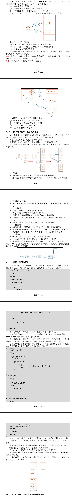

# 进程、线程、中断的核心：栈
- 中断中断，中断谁？
- 中断当前正在运行的进程、线程。
- 进程、线程是什么？内核如何切换进程、线程、中断？
- 要理解这些概念，必须理解栈的作用。

## ARM处理器程序运行的过程

# Linux 系统对中断处理的演进
- Linux 系统中有硬件中断，也有软件中断。对硬件中断的处理有 2 个原则：
    - 不能嵌套，越快越好。
    - 参考资料：
        - https://blog.csdn.net/myarrow/article/details/9287169
