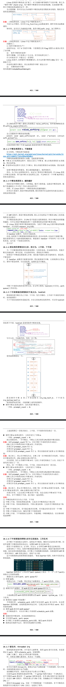

# Linux系统对中断处理的演进
- 从 2005 年我接触 Linux 到现在 15 年了，Linux 中断系统的变化并不大。比较重要的就是引入了 threaded irq：使用内核线程来处理中断。
- Linux 系统中有硬件中断，也有软件中断。对硬件中断的处理有 2 个原则：
    - 不能嵌套，越快越好。
- 参考资料：    
    https://blog.csdn.net/myarrow/article/details/9287169
---
## Linux 对中断的扩展：硬件中断、软件中断
