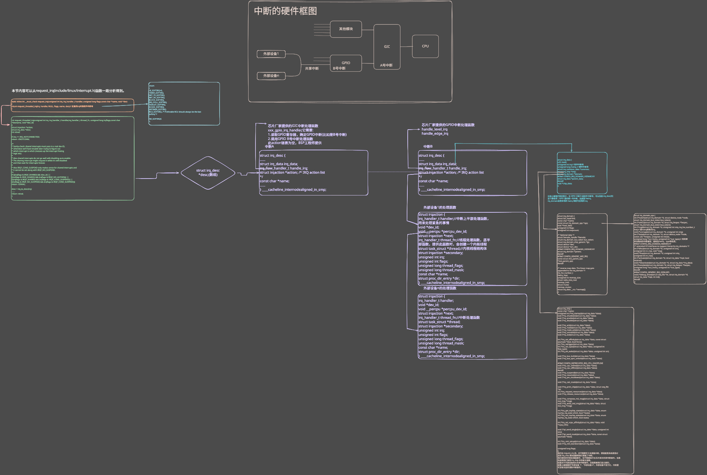

# Linux 中断系统中的重要数据结构
- 本节内容，可以从 request_irq(include/linux/interrupt.h)函数一路分析得到。
- 能弄清楚下面这个图，对 Linux 中断系统的掌握也基本到位了。

- 最核心的结构体是 irq_desc，之前为了易于理解，我们说在 Linux 内核中有一个中断数组，对于每一个硬件中断，都有一个数组项，这个数组就是irq_desc 数组。
- 注意：如果内核配置了 CONFIG_SPARSE_IRQ，那么它就会用基数树(radix tree)来代替 irq_desc 数组。SPARSE 的意思是“稀疏”，假设大小为 1000 的数组中只用到 2 个数组项，那不是浪费嘛？所以在中断比较“稀疏”的情况下可以用基数树来代替数组。

