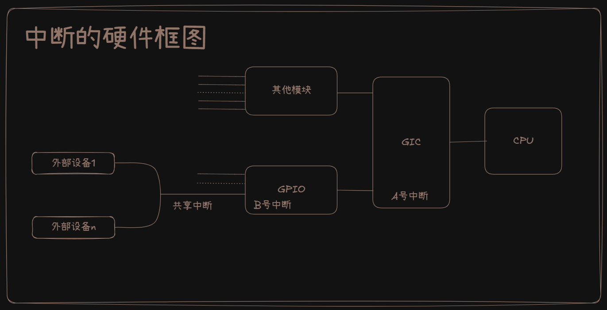

# 在设备树中指定中断_在代码中获得中断
## 设备树里中断节点的语法
- 参考文档:
    - 内核Documentation/devicetree/bindings/interrupt-controller/interrupts.txt

### 设备树里的中断控制器
- 中断的硬件框图如下：

- 在硬件上，“中断控制器”只有 GIC 这一个，但是我们在软件上也可以把上图中的“GPIO”称为“中断控制器”。很多芯片有多个 GPIO 模块，比如 GPIO1、GPIO2 等等。所以软件上的“中断控制器”就有很多个：GIC、GPIO1、GPIO2 等等。
- GPIO1 连接到 GIC，GPIO2 连接到 GIC，所以 GPIO1 的父亲是 GIC，GPIO2的父亲是 GIC。
- 假设 GPIO1 有 32 个中断源，但是它把其中的 16 个汇聚起来向 GIC 发出一个中断，把另外 16 个汇聚起来向 GIC 发出另一个中断。这就意味着 GPIO1 会用到 GIC 的两个中断，会涉及 GIC 里的 2 个 hwirq。
- 这些层级关系、中断号(hwirq)，都会在设备树中有所体现。
- 在设备树中，中断控制器节点中必须有一个属性： interrupt-controller，表明它是“中断控制器”。
- 还必须有一个属性：#interrupt-cells，表明引用这个中断控制器的话需要多少个 cell。
- #interrupt-cells 的值一般有如下取值：
    - **#interrupt-cells=<1>**
        别的节点要使用这个中断控制器时，只需要一个 cell 来表明使用“哪一个中断”。
    - **#interrupt-cells=<2>**
        别的节点要使用这个中断控制器时，需要一个 cell 来表明使用“哪一个中断”；还需要另一个 cell 来描述中断，一般是表明触发类型：
        ```dts
        第 2 个 cell 的 bits[3:0] 用来表示中断触发类型(trigger type and level flags)：
        1 = low-to-high edge triggered，上升沿触发
        2 = high-to-low edge triggered，下降沿触发
        4 = active high level-sensitive，高电平触发
        8 = active low level-sensitive，低电平触发
        ```
        示例如下:
        ```dts
        vic: intc@10140000 {
            compatible = "arm,versatile-vic";
            interrupt-controller;
            #interrupt-cells = <1>;
            reg = <0x10140000 0x1000>;
        };
        ```
    - 如果中断控制器有级联关系，下级的中断控制器还需要表明它的“ interrupt-parent ” 是谁，用了“interrupt-parent”中的哪一个“interrupts”，请看下一小节。
### 设备树里使用中断
- 一个外设，它的中断信号接到哪个“中断控制器”的哪个“中断引脚”，这个中断的触发方式是怎样的？
- interrupt-parent=<&xxxx>
    你要用哪一个中断控制器里的中断？
- interrupts
    你要用哪一个中断？
    Interrupts 里要用几个 cell，由 interrupt-parent 对应的中断控制器决定。在中断控制器里有“#interrupt-cells”属性，它指明了要用几个 cell来描述中断。
- 比如:
```c
i2c@7000c000 {
    gpioexit: gpio-adnp@41 {
        compatible = "ad,gpio-adno";

        interrupt-parent = <&gpio>;
        interrupts = <160 1>;

        gpio-controller;
        #gpio-cells = <1>
        
        interrupt-controller;
        #interrupt-cells = <2>;
    };
    ......
};
```
- 新写法: interrupts-extended
    - 一个“interrupts-extended”属性就可以既指定“interrupt-parent”，也指定“interrupts”，比如：
```c
interrupts-extended = <&intc1 5 1>, <&intc2 1 0>;
```