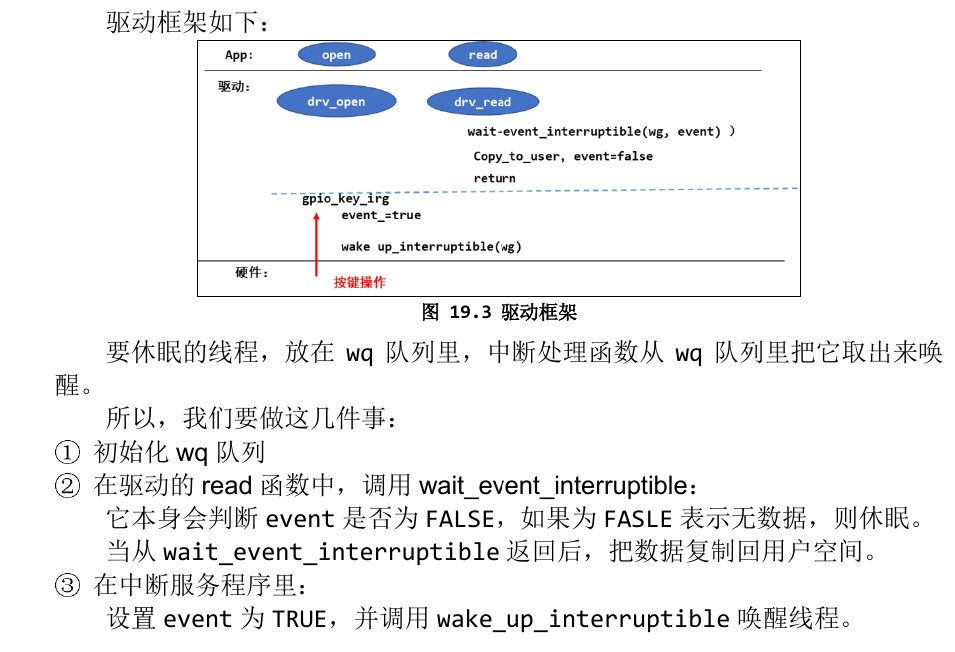

# 休眠与唤醒
- 请记住：**在中断处理函数中，不能休眠，也就不能调用会导致休眠的
函数。**
## 内核函数
### 1 休眠函数
参考内核源码:include/linux/wait.h
- 1.wait_event_interruptible
```c
#define wait_event_interruptible(wq_head, condition)				\
({										\
	int __ret = 0;								\
	might_sleep();								\
	if (!(condition))							\
		__ret = __wait_event_interruptible(wq_head, condition);		\
	__ret;									\
})
```
> 休眠，直到condition为真，休眠期间是可被打断的，可以被信号打断。
- 2 wait_event
```c
#define wait_event(wq_head, condition)						\
do {										\
	might_sleep();								\
	if (condition)								\
		break;								\
	__wait_event(wq_head, condition);					\
} while (0)
```
> 休眠，直到condition为真，退出的唯一条件是condition为真，信号也不好使。

- 3 wait_interruptible_timeout
```c
#define wait_event_interruptible_timeout(wq_head, condition, timeout)		\
({										\
	long __ret = timeout;							\
	might_sleep();								\
	if (!___wait_cond_timeout(condition))			\
		__ret = __wait_event_interruptible_timeout(wq_head,		\
						condition, timeout);		\
	__ret;									\
})
```
> 休眠，直到condition为真或超时，休眠期间是可被打断的，可以被信号打断
- 4 wait_event_timeout
```c
#define wait_event_timeout(wq_head, condition, timeout)				\
({										\
	long __ret = timeout;							\
	might_sleep();								\
	if (!___wait_cond_timeout(condition))					\
		__ret = __wait_event_timeout(wq_head, condition, timeout);	\
	__ret;									\
})
```
> 休眠，直到 condition 为真；退出的唯一条件是 condition 为真，信号也不好使

- 比较重要的参数就是:
    - 1. wq:waitqueue，等待队列
        - 1.休眠时除了把程序状态改为非 RUNNING 之外，还要把进程/进程放入wq 中，以后中断服务程序要从 wq 中把它取出来唤醒。
        - 2.没有 wq 的话，茫茫人海中，中断服务程序去哪里找到你？
    - 2. condition 
        - 这可以是一个变量，也可以是任何表达式。表示“一直等待，直到为真”。
---
### 2 唤醒函数
参考内核源码:include/linux/wait.h
- 1.wake_up_interruptible(x)
```c
#define wake_up_interruptible(x)	__wake_up(x, TASK_INTERRUPTIBLE, 1, NULL)
```
> 唤醒 x 队列中状态为“TASK_INTERRUPTIBLE”的线程，只唤醒其中的一个线程

- 2.wake_up_interruptible_ nr(x,nr)
```c
#define wake_up_interruptible_nr(x, nr)	__wake_up(x, TASK_INTERRUPTIBLE, nr, NULL)
```
> 唤醒 x 队列中状态为“TASK_INTERRUPTIBLE”的线程，只唤醒其中的 nr 个线程

- 3.wake_up_interruptible_all(x)
```c
#define wake_up_interruptible_all(x)	__wake_up(x, TASK_INTERRUPTIBLE, 0, NULL)
```
> 唤醒 x 队列中状态为“TASK_INTERRUPTIBLE”的线程，唤醒其中的所有线程

- 4.wake_up(x)
```c
#define wake_up(x)			__wake_up(x, TASK_NORMAL, 1, NULL)
```
> 唤 醒 x 队 列 中 状 态 为 “ TASK_INTERRUPTIBLE ” 或“TASK_UNINTERRUPTIBLE”的线程，只唤醒其中的一个线程

- 5.wake_up_nr(x.nr)
```c
#define wake_up_nr(x, nr)		__wake_up(x, TASK_NORMAL, nr, NULL)
```
> 唤 醒 x 队 列 中 状 态 为 “ TASK_INTERRUPTIBLE ” 或“TASK_UNINTERRUPTIBLE”的线程，只唤醒其中 nr 个线程

- 6.wake_up_all(x)
```c
#define wake_up_all(x)			__wake_up(x, TASK_NORMAL, 0, NULL)
```
> 唤 醒 x 队 列 中 状 态 为 “ TASK_INTERRUPTIBLE ” 或“TASK_UNINTERRUPTIBLE”的线程，唤醒其中的所有线程

## 驱动框架

