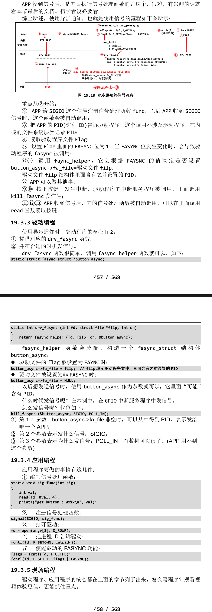

# 异步通知
## 使用流程
- 驱动程序怎么通知 APP：发信号，这只有 3 个字，却可以引发很多问题：
- Linux 系统中也有很多信号，在 Linux 内核源文件 include\uapi\asm-generic\signal.h 中，有很多信号的宏定义：
```c
#define SIGHUP		 1
#define SIGINT		 2
#define SIGQUIT		 3
#define SIGILL		 4
#define SIGTRAP		 5
#define SIGABRT		 6
#define SIGIOT		 6
#define SIGBUS		 7
#define SIGFPE		 8
#define SIGKILL		 9
#define SIGUSR1		10
#define SIGSEGV		11
#define SIGUSR2		12
#define SIGPIPE		13
#define SIGALRM		14
#define SIGTERM		15
#define SIGSTKFLT	16
#define SIGCHLD		17
#define SIGCONT		18
#define SIGSTOP		19
#define SIGTSTP		20
#define SIGTTIN		21
#define SIGTTOU		22
#define SIGURG		23
#define SIGXCPU		24
#define SIGXFSZ		25
#define SIGVTALRM	26
#define SIGPROF		27
#define SIGWINCH	28
#define SIGIO		29 //驱动常用信号，表示有IO事件
#define SIGPOLL		SIGIO
```
- 就 APP 而言，你想处理 SIGIO 信息，那么需要提供信号处理函数，并且要跟SIGIO 挂钩。这可以通过一个 signal 函数来“给某个信号注册处理函数”，用法如下：
```c
#include <signal.h>
typedef void (*sighandler_t)(int);//1.先编写函数
sighandler_t signal(int signum,sighandler_t handler);//2.注册信号处理函数
```
> APP 还要做什么事？想想这几个问题：
- a) 内核里有那么多驱动，你想让哪一个驱动给你发 SIGIO 信号？
    - APP 要打开驱动程序的设备节点。
- b) 驱动程序怎么知道要发信号给你而不是别人？
    - APP 要把自己的进程 ID 告诉驱动程序。
- c) APP 有时候想收到信号，有时候又不想收到信号：
- 应该可以把 APP 的意愿告诉驱动。
> 驱动程序要做什么？发信号。
- a) APP 设置进程 ID 时，驱动程序要记录下进程 ID；
- b) APP 还要使能驱动程序的异步通知功能，驱动中有对应的函数：
    - APP 打开驱动程序时，内核会创建对应的 file 结构体，file 中有 f_flags；
    - f_flags 中有一个 FASYNC 位，它被设置为 1 时表示使能异步通知功能。
    - 当 f_flags 中的 FASYNC 位发生变化时，驱动程序的 fasync 函数被调用。
d) 发生中断时，有数据时，驱动程序调用内核辅助函数发信号。
    - 这个辅助函数名为 kill_fasync。完美！
    