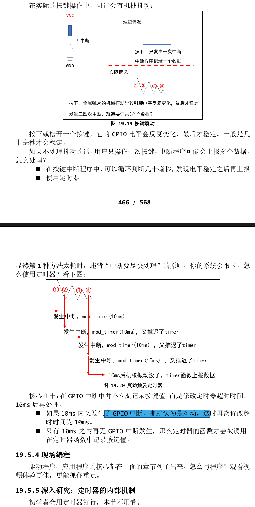

# 定时器
## 内核函数
- 所谓定时器，就是闹钟，时间到后你就要做某些事。有 2 个要素：时间、做事，换成程序员的话就是：超时时间、函数。
- 在内核中使用定时器很简单，涉及这些函数 ( 参考内核源码
include\linux\timer.h)：
    - setup_timer(timer,fn,data);
        设置定时器，主要是初始化 timer_list 结构体，设置其中的函数、参数。
    -  void add_timer(struct timer_list *timer);
        向内核添加定时器。timer->expires 表示超时时间。
        当超时时间到达，内核就会调用这个函数timer->function(timer->data)。
    -  int mod_timer(struct timer_list *timer, unsigned long expires):
        修改定时器的超时时间，它等同于：
        del_timer(timer); 
        timer->expires = expires;
        add_timer(timer);
        但是更加高效。
    -   int del_timer(struct timer_list *timer)：
        删除定时器。
## 定时器时间单位
- 编译内核时，可以在内核源码根目录下用“ls -a”看到一个隐藏文件，它就是内核配置文件。打开后可以看到如下这项：
> CONFIG_HZ=100
- 这表示内核每秒中会发生 100 次系统滴答中断(tick)，这就像人类的心跳一样，这是 Linux 系统的心跳。每发生一次 tick 中断，全局变量 jiffies 就会累加 1。
- CONFIG_HZ=100 表示每个滴答是 10ms。
- 定时器的时间就是基于 jiffies 的，我们修改超时时间时，一般使用这 2 种方法：
    - 1.在add_timer之前，直接修改：
    ```c
    timer.expires = jiffies + xxx; // xxx 表示多少个滴答后超时，也就是 xxx*10ms
    timer.expires = jiffies + 2*HZ; // HZ 等于 CONFIG_HZ，2*HZ 就相当于 2 秒
    ```
    - 2.在add_timer之后，使用mod_timer修改：
    ```c
    mod_timer(&timer, jiffies + xxx); // xxx 表示多少个滴答后超时，也就是 xxx*10ms
    mod_timer(&timer, jiffies + 2*HZ); // HZ 等于 CONFIG_HZ，2*HZ 就相当于 2 秒
    ```
## 使用定时器处理按键抖动
