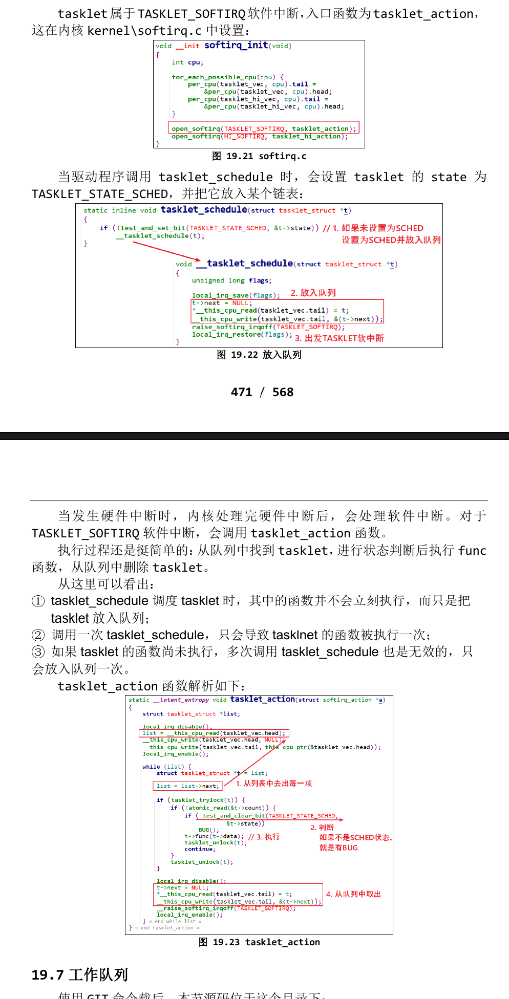

# 中断下半部tasklet
- 在前面我们介绍过中断上半部、下半部。中断的处理有几个原则：
⚫ 不能嵌套；
⚫ 越快越好。
- 在处理当前中断时，即使发生了其他中断，其他中断也不会得到处理，所以中断的处理要越快越好。但是某些中断要做的事情稍微耗时，这时可以把中断拆分为上半部、下半部。
    - **在上半部处理紧急的事情，在上半部的处理过程中，中断是被禁止的；**
    - **在下半部处理耗时的事情，在下半部的处理过程中，中断是使能的。**
## 内核函数
- 1.定义tasklet
    - 中断下半部使用结构体tasklet_struct来表示，它在内核源码**include\linux\interrupt.h**中定义：
    ```c
    struct tasklet_struct
    {
        struct tasklet_struct *next;
        unsigned long state;
        atomic_t count;
        void (*func)(unsigned long);
        unsigned long data;
    };
    ```
    - ⚫ 其中的 state 有 2 位：
        - ◼ bit0 表示 TASKLET_STATE_SCHED
            - 等于 1 时表示已经执行了 tasklet_schedule 把该 tasklet 放入队列了；tasklet_schedule 会判断该位，如果已经等于 1 那么它就不会再次把tasklet 放入队列。
        - ◼ bit1 表示 TASKLET_STATE_RUN 
            - 等于 1 时，表示正在运行 tasklet 中的 func 函数；函数执行完后内核会把该位清 0。
    - ⚫ 其中的 count 表示该 tasklet 是否使能：等于 0 表示使能了，非 0 表示被禁止了。对于 count 非 0 的 tasklet，里面的 func 函数不会被执行。
- 使用中断下半部之前，要先实现一个 tasklet_struct 结构体，这可以用这2 个宏来定义结构体：
```c
#define DECLARE_TASKLET(name, func, data) \
struct tasklet_struct name = { NULL, 0, ATOMIC_INIT(0), func, data }
#define DECLARE_TASKLET_DISABLED(name, func, data) \
struct tasklet_struct name = { NULL, 0, ATOMIC_INIT(1), func, data }
```
- ◼ 使用 DECLARE_TASKLET 定义的 tasklet 结构体，它是使能的；
- ◼ 使用 DECLARE_TASKLET_DISABLED 定义的 tasklet 结构体，它是禁止的；使用之前要先调用 tasklet_enable 使能它。
- 也可以使用函数来初始化 tasklet 结构体：
```c
extern void tasklet_init(struct tasklet_struct *t,void (*func)(unsigned long), unsigned long data);
```
- 2.使能/禁止tasklet
```c
static inline void tasklet_enable(struct tasklet_struct *t);
static inline void tasklet_disable(struct tasklet_struct *t);
```
- ◼ tasklet_enable 把 count 减 1；
- ◼ tasklet_disable 把 count 增 1。
- 3.调度tasklet
```c
static inline void tasklet_schedule(struct tasklet_struct *t);
```
- ◼把 tasklet 放入链表，并且设置它的 TASKLET_STATE_SCHED 状态为
1。
- 4.kill tasklet
```c
extern void tasklet_kill(struct tasklet_struct *t);
```
- ◼ 如果一个tasklet未被调度，tasklet_kill会把它的TASKLET_STATE_SCHED 状态清 0；
- ◼ 如果一个 tasklet 已被调度，tasklet_kill 会等待它执行完华，再把它的 TASKLET_STATE_SCHED 状态清 0。
- 通常在卸载驱动程序时调用 tasklet_kill。
## tasklet使用方法
- 先定义 tasklet，需要使用时调用 tasklet_schedule，驱动卸载前调用tasklet_kill。
- tasklet_schedule 只是把 tasklet 放入内核队列，它的 func 函数会在软件中断的执行过程中被调用。
## tasklet内部机制
