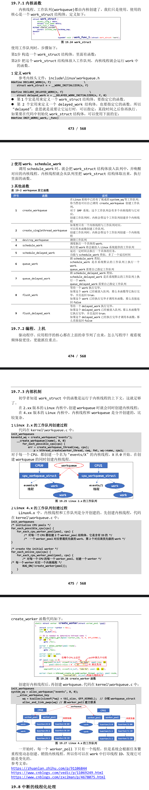

# 工作队列
- 前面讲的定时器、下半部 tasklet，它们都是在中断上下文中执行，它们无法休眠。当要处理更复杂的事情时，往往更耗时。这些更耗时的工作放在定时器或是下半部中，会使得系统很卡；并且循环等待某件事情完成也太浪费 CPU 资源了。
- 如果使用线程来处理这些耗时的工作，那就可以解决系统卡顿的问题：因为线程可以休眠。
- 在内核中，我们并不需要自己去创建线程，可以使用“工作队列”(workqueue)。内核初始化工作队列是，就为它创建了内核线程。以后我们要使用“工作队列”，只需要把“工作”放入“工作队列中”，对应的内核线程就会取出“工作”，执行里面的函数。
- 2.xx 的内核中，工作队列的内部机制比较简单；在现在 4.x 的内核中，工作队列的内部机制做得复杂无比，但是用法是一样的。
- 队列的应用场合：要做的事情比较耗时，甚至可能需要休眠，那么可以
使用工作队列。
- 缺点：多个工作(函数)是在某个内核线程中依序执行的，前面函数执行很慢，就会影响到后面的函数。
- 在多 CPU 的系统下，一个工作队列可以有多个内核线程，可以在一定程度上缓解这个问题。
- 我们先使用看看怎么使用工作队列。
