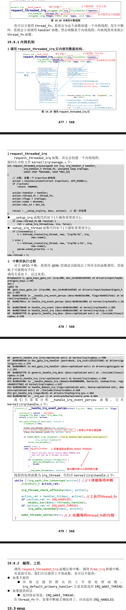

# 中断的线程化处理
- 复杂、耗时的事情，尽量使用内核线程来处理。上节视频介绍的工作队列用起来挺简单，但是它有一个缺点：工作队列中有多个 work，前一个 work 没处理完会影响后面的 work。解决方法有很多种，比如干脆自己创建一个内核线程，不跟别的 work 凑在一块了。在 Linux 系统中，对于存储设备比如 SD/TF 卡，它的驱动程序就是这样做的，它有自己的内核线程。
- 对于中断处理，还有另一种方法：threaded irq，线程化的中断处理。中断的处理仍然可以认为分为上半部、下半部。上半部用来处理紧急的事情，下半部用一个内核线程来处理，这个内核线程专用于这个中断。
- 内核提供了这个函数：
